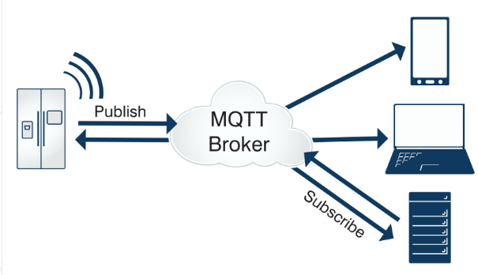
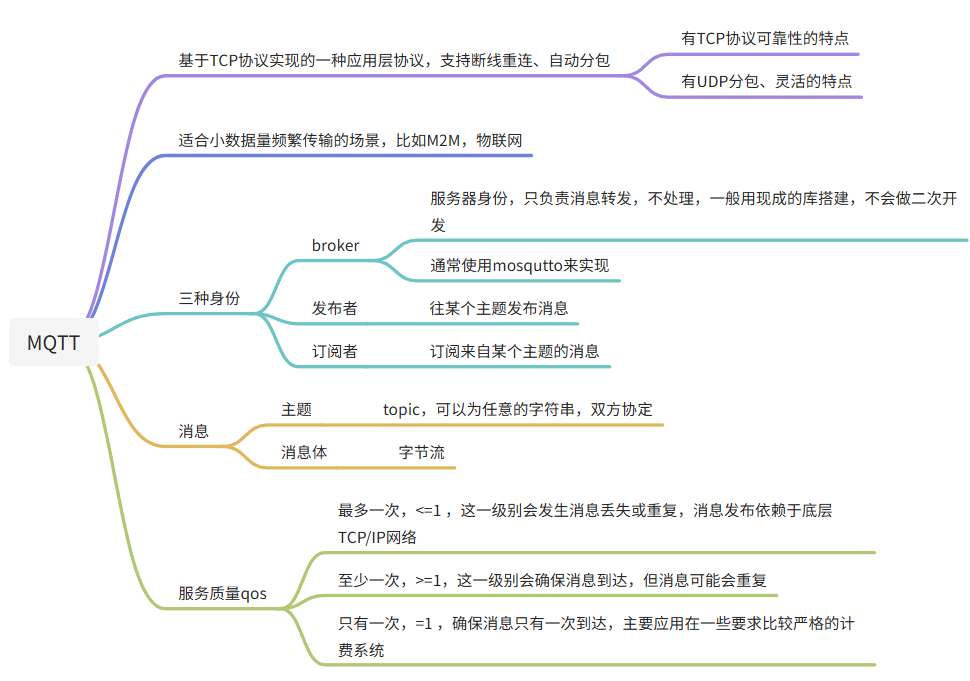

# MQTT
了解MQTT
MQTT 入门介绍
https://www.runoob.com/w3cnote/mqtt-intro.html
读一、四部分（4.5不需要看）即可。
模型图


# 体验MQTT
## 搭建MQTT服务器（Broker）
## Linux版本
```
tar xf mosquitto-1.6.3.tar.gz
cd mosquitto-1.6.3/
make
sudo make install
```
安装完成后，终端输入mosquitto命令即可运行。端口默认是1883
```
$ mosquitto
1639476502: mosquitto version 1.6.3 starting
1639476502: Using default config.
1639476502: Opening ipv4 listen socket on port 1883.
1639476502: Opening ipv6 listen socket on port 1883.
```
## 公网版本
地址：81.70.41.78
注意仅做测试用，项目中还是自己搭建。
## FX客户端测试
PC客户端测试推荐使用MQTT.fx客户端软件
官网下载地址:
http://mqttfx.jensd.de/index.php/download（资料包中取，不用下最新的）
Client ID是客户端唯一标识（类似与QQ），测试时候注意客户端ID不能一样，否则会出现互顶现象，可使用Generate按钮产生随机ID。

```
网络问题（仔细看）
这部分的测试要保证虚拟机和windows主机能互相ping通，如果能通，不需要再往下看了，如果不通可以尝试以下解决方案。
主机能ping通虚拟机，反之不行
检查windows防火墙是否关闭。
网络问题(windows和虚拟机不能互相ping通)
尝试修改为NAT模式解决
如果不通，并且配置为桥接模式，那么尝试切换为NAT模式。
点击虚拟机--设置，选择网络适配器，然后把桥接改为NAT模式，再次尝试连接。虚拟机获取到的IP可能和windows不是一个段，但是只要能互相ping通即可。

还原网卡配置解决
1. 如果NAT模式不行，点击编辑--虚拟网络编辑器，查看虚拟机是否缺少网卡，正常情况下，是0 1 8三个网卡。windows非管理员账号需要点击右下角的更改设置，才能看到第三个网卡。

3. 如果点击了更改设置，仍只有两个网卡，这就代表你的虚拟机网卡有问题，那么就需要还原了，还原这个操作必须先关闭虚拟机。

4. 点击还原默认设置（这个时间可能会比较长），等待完成后看是否三个网卡都出现，然后重新启动虚拟机，基本就可以解决网络问题。
如果还原不成功，按照下面方式再试试
https://blog.csdn.net/m0_62592329/article/details/128398767?ops_request_misc=%257B%2522request%255Fid%2522%253A%2522171435623816777224472066%2522%252C%2522scm%2522%253A%252220140713.130102334..%2522%257D&request_id=171435623816777224472066&biz_id=0&utm_medium=distribute.pc_search_result.none-task-blog-2~all~top_positive~default-1-128398767-null-null.142^v100^pc_search_result_base4&utm_term=%E8%99%9A%E6%8B%9F%E6%9C%BA%E6%B2%A1%E6%9C%89vmnet0&spm=1018.2226.3001.4187
网络ping通后仍连不上
看下是否未开启mosquitto服务
```
## 客户端开发
## 库编译安装
官方下载地址
https://github.com/eclipse/paho.mqtt.c/tree/v1.3.0
把源码包放到自己家目录任意位置，执行下面的指令
如果没有cmake工具，那么先用sudo apt-get -y install cmake安装cmake
unzip paho.mqtt.c-1.3.0.zip
cd paho.mqtt.c-1.3.0/
cmake -DCMAKE_INSTALL_PREFIX=/usr
make
sudo make install
源码目录下的src/samples中是官方示例demo，可修改demo中MQTTClient_subscribe.c（订阅）和MQTTClient_publish.c（发布），编写我们需要的代码。
## 代码分析
/*******************************************************************************
 * Copyright (c) 2012, 2017 IBM Corp.
 *
 * All rights reserved. This program and the accompanying materials
 * are made available under the terms of the Eclipse Public License v1.0
 * and Eclipse Distribution License v1.0 which accompany this distribution. 
 *
 * The Eclipse Public License is available at 
 *   http://www.eclipse.org/legal/epl-v10.html
 * and the Eclipse Distribution License is available at 
 *   http://www.eclipse.org/org/documents/edl-v10.php.
 *
 * Contributors:
 *    Ian Craggs - initial contribution
 *******************************************************************************/

#include <stdio.h>
#include <stdlib.h>
#include <string.h>
#include "MQTTClient.h"

#define ADDRESS     "tcp://192.168.31.240:1883"
#define CLIENTID    "ExampleClientSub"
#define TOPIC       "MQTT Examples"
#define PAYLOAD     "Hello World!"
#define QOS         1
#define TIMEOUT     10000L

volatile MQTTClient_deliveryToken deliveredtoken;

void delivered(void *context, MQTTClient_deliveryToken dt)
{
    printf("Message with token value %d delivery confirmed\n", dt);
    deliveredtoken = dt;
}

/**
 * @brief 
 * 
 * @param context 
 * @param topicName 收到来自哪个主题的消息
 * @param topicLen 主题的长度
 * @param message 消息体:payload(消息体，字符串)  payloadlen：消息的长度
 * @return int 
 */
int msgarrvd(void *context, char *topicName, int topicLen, MQTTClient_message *message)
{
    int i;
    char* payloadptr;

    printf("Message arrived\n");
    printf("     topic: %s\n", topicName);
    printf("   message: ");
#if 0
    payloadptr = message->payload;
    for(i=0; i<message->payloadlen; i++)
    {
        putchar(*payloadptr++);
    }
#endif
    printf("recv msg = %s\n", (char *)message->payload);

    MQTTClient_freeMessage(&message);
    MQTTClient_free(topicName);
    return 1;
}

void connlost(void *context, char *cause)
{
    printf("\nConnection lost\n");
    printf("     cause: %s\n", cause);
}

int main(int argc, char* argv[])
{
    //客户端句柄（描述符）
    MQTTClient client;
    //连接参数
    MQTTClient_connectOptions conn_opts = MQTTClient_connectOptions_initializer;
    int rc;
    int ch;

    //创建客户端，并且指定客户端连接的mqtt服务器地址和客户端ID
    MQTTClient_create(&client, ADDRESS, CLIENTID,
        MQTTCLIENT_PERSISTENCE_NONE, NULL);

    //初始化连接参数
    conn_opts.keepAliveInterval = 20;
    conn_opts.cleansession = 1;

    //设置回调接口，只需要关注msgarrvd：消息到达后，会自动调用这个接口
    MQTTClient_setCallbacks(client, NULL, connlost, msgarrvd, delivered);

    //连接到broker
    if ((rc = MQTTClient_connect(client, &conn_opts)) != MQTTCLIENT_SUCCESS)
    {
        printf("Failed to connect, return code %d\n", rc);
        exit(EXIT_FAILURE);
    }

    printf("Subscribing to topic %s\nfor client %s using QoS%d\n\n"
           "Press Q<Enter> to quit\n\n", TOPIC, CLIENTID, QOS);

    //订阅某个主题，指定订阅主题的名字，可以指定qos服务质量
    MQTTClient_subscribe(client, TOPIC, QOS);

    //死循环，直到收到了一个q就退出
    do 
    {
        ch = getchar();
    } while(ch!='Q' && ch != 'q');

    MQTTClient_unsubscribe(client, TOPIC);
    MQTTClient_disconnect(client, 10000);
    MQTTClient_destroy(&client);
    return rc;
}

注意：接收回调函数的返回值一定不要改，返回0会导致段错误。
## 编码测试
以MQTTClient_subscribe.c为例，修改代码中IP地址和主题即可完成最简单的通信。

使用如下命令编译代码，注意需要指定需要的库-l paho-mqtt3c
gcc MQTTClient_subscribe.c -l paho-mqtt3c
编译完执行即可
samples$ ./a.out
Subscribing to topic MQTT Examples
for client ExampleClientSub using QoS1

Press Q<Enter> to quit
websocket-mqtt
websocket是什么
● Http协议是短连接，只支持请求-应答模式，不适合做频繁数据通信。
● 浏览器中的 JavaScript 无法直接建立裸的 TCP 连接（出于安全考虑）。
● WebSocket是基于TCP之上实现的应用层协议，属于HTML5 标准的一部分，浏览器原生支持。它允许JavaScript 建立一个持久的、全双工的连接。
● 在前端领域，MQTT 是通过 WebSocket 来实现的。WebSocket 是 MQTT 在浏览器中的“运输通道”。
broker配置支持
此时需要在编译mosquitto时增加websocket的支持。在config.mk文件中把WITH_WEBSOCKETS选项改为yes即可。
WITH_WEBSOCKETS:=yes
过程中需要依赖于libwebsockets库的支持。
sudo apt-get install libwebsockets-dev
● 直接输入mosquitto命令启动，使用的是内置的硬编码默认配置。
● 如果要自定义配置，需要指定配置文件。
# 显式声明 TCP 监听器
listener 1883
protocol mqtt  # 显式声明，虽然默认就是 mqtt

# 显式声明 WebSocket 监听器
listener 9002
protocol websockets
mosquitto -c ./mosquitto.conf
前端参考代码

## 综合练习
利用网页和Linux端程序实现一个简单的聊天功能，把网页当成上位机，Linux程序当成下位机，北向数据流通过"up"主题通信，南向数据流通过"down"主题通信。使用如下的json通信格式。
{
	"name": "zhangsan",
	"age": 16,
	"msg": "hello world"
}
## 编码提示
● mqtt的连接类似与TCP的连接，有且仅有一个连接。连接和订阅动作不能放到循环中。
● 官方订阅和发布是两个例子，需要整合到一个代码里，最后只启动一个进程 。进程启动后，从终端获取用户输入然后发送给网页，并且能接收来自网页的消息。终端只接收即时输入的msg即可，name和age按照上面的例子定死即可。
● JSON的处理，有些接口可以直接删除或者替换局部的节点。比如：
//替换某个节点
void cJSON_ReplaceItemInObject(cJSON *object,const char *string,cJSON *newitem);
//删除某个节点
void cJSON_DeleteItemFromObject(cJSON *object,const char *string);
● 增加多个库的连接继续增加-l选项即可，比如：
gcc a.c b.c -l paho-mqtt3c -l m //同时链接了mqtt库和数学库
## 前端开发
前端推荐使用AI进行开发，练习使用markdown来编写提示词，核心通信代码提供给AI，让AI补充业务代码。

## 综合项目注意
● 调试阶段可以直接本地运行前端页面测试效果，但是实际工程中要把前端的代码集成到thttpd服务器中。
● 如果在消息读取的回调msgarrvd中直接执行发送动作，调用MQTTClient_publishMessage发送完毕后，不要调用MQTTClient_waitForCompletion方法等待，等待的设计机制可能和接收线程有冲突。这个问题在上述练习中因为是分离线程，所以不会暴露，大项目中有相关需求，需要注意！！

