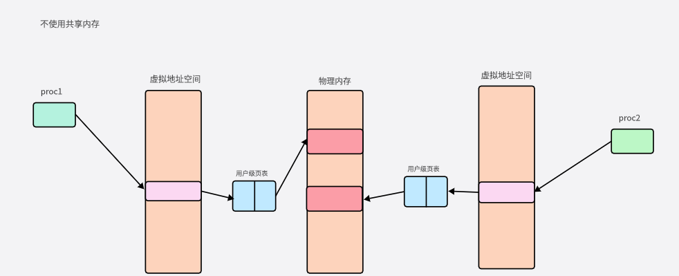
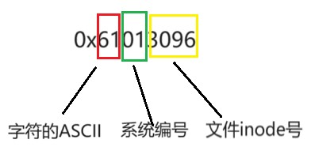

# 进程通信
## 共享内存+
### 概念
共享内存是操作系统在物理内存中申请一块空间，应用程序可以应烧到这块空间，进行直接读写操作
### 特点
1) 共享内存是一种最为高效的进程间通信方式，进程可以直接读写内存，而不需熬任何数据的拷贝
2) 为了在多个进程间交换信息，内核专门流出了一块内存区，可以由需要访问的进程将其映射到自己的私有地址空间
3) 进程就可以直接读写这内存区而不需要进行数据的拷贝，从而大大提高的效率。
4) 由于多个进程共享一段内存，因此也需要依靠某种同步机制，如互斥锁和信号量等
 
.jpg>)
### 步骤
1. 创建唯一key值        	ftok
2. 创建或打开共享内存		 shmget
3. 映射共享内存到用户空间	 shmat
4. 撤销映射			shmdt
5. 删除共享内存			shmctl
### 函数接口
#### 创建key值
```c
#include <sys/type.h>
#include <sys/ipc.h>
key_t ftock(const char *pathname, int proj_id);
功能：pathname：文件名
	  proj_id：取整数的低8位数据
返回值：成功：key值
		失败：-1
```

补充：
	key值是根据pathname的inode号和proj_id的低8位组合而成的，如：0x61013096
	pathname只是要是路径中存在的文件即可

#### 创建共享内存			<!-- shared memory get -->
```c
#include <sys/ipc.h>
#include <sys/shm.h>
int shmget(key_t key, size_t size, int shmflg);
功能：创建或打开共享内存
参数：
	key		赋值
	size	共享内存大小
			  创建		检测错误
	shmflg	IPC_CREAT | IPC_EXCL | 0777	创建共享内存的时候的权限
	返回值：成功	shmid	共享内存的id
		    出错	-1

```

#### 映射共享内存

```c
#include <sys/types.h>
#include <sys/shm.h>
void *shmat(int shmid, const void *shmaddr, int shmflg);
功能：映射共享内存，即把指定的共享内存映射到进程的地址空间用于访问
参数：shmid：共享内存的id号
      shmadd：一般为NULL，表示由系统自动完成映射
              如果不为NULL，那么由用户指定
      shmflg：SHM_RDONLYH就是对该共享内存进行只读操作
                  0  可读可写
返回值：成功：完成映射后的地址
        出错：(void *)-1的地址

```
#### 取消映射
```c
#include <sys/shm.h>
int shmdt(const void *shmaddr);
功能：取消映射
参数：shmaddr：要取消映射的共享内存地址
返回值：成功：0
        失败：-1

```
#### 删除共享内存
```c
#include <sys/shm.h>
int shmctl(int shmid, int cmd, struct shmid_ds *buf);
功能：(删除共享内存), 对共享内存进行各种操作
参数：shmid  共享内存id
      cmd     IPC_STAT  获取shmid属性信息，存放在第三个参数
              IPC_SET设置shmid属性信息，要设置的属性存放在第三个参数
              IPC_RMID删除共享内存，此时第三个参数为NULL
      buf  是一个结构体指针，但是我们是删除共享内存，所以没有意义，我们直接设置为NULL就可以
返回值：成功 0
        失败 -1

```
#### 操作命令
pcs -m: 查看系统中的共享内存
ipcrm -m shmid：删除共享内存

ps: 不能直接删除掉还存在进程使用的共享内存。
这时候可以用ps -ef对进程进行查看，kill掉多余的进程后，再使用ipcs查看。

## 信号灯集
### 特点
信号灯(semaphore)，也叫信号量。它是不同进程间或一个给定进程内部不同线程间同步的机制；
System V信号灯集是一个或者多个信号灯的一个集合。其中的每一个都是单独的计数信号灯。而Posix信号灯指的是单个计数信号灯。
通过信号灯集实现共享内存的同步操作
### 步骤
1. 创建key值			ftok
2. 创建或打开信号灯集	 semget
3. 初始化信号灯			semctl
4. PV操作				semop		让信号灯集+1/-1
5. 删除信号灯集			 semctl
### 操作命令
ipcs	-s: 查看信号灯集
ipcrm	-s	semid: 删除信号灯集
### 函数接口
#### 创建或打开信号灯集
```c
man 2 semget
#include <sys/types.h>
#include <sys/ipc.h>
#include <sys/sem.h>
int semget(key_t key, int nsems, int semflg);
功能：创建/打开信号灯
参数：key：ftok产生的key值
	  nsems：信号灯集中包含的信号灯数目
	  semflg：信号灯集的访问权限，
	  				通常为IPC_CREAT | IPC_EXCL | 0666
返回值：成功：信号灯集ID
		失败：-1
```

如果返回semget err: Success
那就是semid等于0的情况
需要我们手动删除这个信号灯集
ipcs  -s  ：查看创建的信号灯集
ipcrm  -s  [semid]：删除信号灯集
#### 初始化或删除信号灯集

```c
#include <sys/sem.h>
int semctl(int semid, int semnum, int cmd, ...);
功能：信号灯集的控制(初始化、删除)
参数：semid：信号灯集id
    semnum：要操作集合中的信号灯编号
    cmd：
        GETVAL：获取信号灯的值
        SETVAL：设置信号灯的值
        IPC_RMID：从系统中删除信号灯集合
    ...：当cmd为SETVAL，需要传递共用体
返回值：成功 0
        失败 -1
共用体格式：
union semun {
   int              val;    /* 信号量的初值 */
   struct semid_ds *buf;    /* Buffer for IPC_STAT, IPC_SET */
   unsigned short  *array;  /* Array for GETALL, SETALL */
   struct seminfo  *__buf;  /* Buffer for IPC_INFO
                                           (Linux-specific) */
};
```
补充：
1. 当cmd为SETVAL时需要传递第四个参数，类型为共用体，
用法：
```c
union semun {
    int val;
};
union semun sem;
sem.val = 10;
semctl(semid, 0, SETVAL, sem); //对编号为0的信号灯设置初值为10
```
2. 当cmd为IPC_RMID时，表示删除信号灯集
用法：semctl(semid, 0, IPC_RMID) // 0：表示信号灯的编号，指定任意一个即可删除
3. 当cmd为GETVAL时，表示获取信号灯的值
用法：printf("%d\n", semctl(semid, 0, GETVAL));
####  pv操作
```c
int semop (int semid, struct sembuf  *opsptr,  size_t  nops);
功能：对信号灯集合中的信号量进行PV操作
参数：semid：信号灯集ID
     opsptr:操作方式
     nops:  要操作的信号灯的个数 1个
返回值：成功 ：0
      失败：-1
struct sembuf {
   short  sem_num; // 要操作的信号灯的编号
   short  sem_op;  //    0 :  等待，直到信号灯的值变成0
                   //   1  :  释放资源，V操作
                   //   -1 :  分配资源，P操作                    
    short  sem_flg; // 0（阻塞）,IPC_NOWAIT, SEM_UNDO
};
```
## 消息队列
### 特点
1. 消息队列就是一个消息的列表。用户可以在消息队列中添加消息、读取消息等。
2. 消息队列可以按照类型来发送/接收消息
3. 在linux下消息队列的大小有限制。
	● 消息队列
    个数最多为16个；
	● 消息队列总容量最多为16384字节；
	● 每个消息内容最多为8192字节。
### 步骤
1.创建key值
2.创建或打开消息队列：msgget
3.添加消息：msgsnd
4.读取消息：msgrcv
5.删除消息队列msgctl

### 函数接口
#### 创建消息队列
```c
#include <sys/types.h>
#include <sys/ipc.h>
#include <sys/msg.h>
int msgget(key_t key, int flag);
功能：创建或打开一个消息队列
参数：  key值
       flag：创建消息队列的权限IPC_CREAT|IPC_EXCL|0666
返回值：成功：msgid
       失败：-1
```

#### 添加消息
```c
int msgsnd(int msgid, const void *msgp, size_t size, int flag); 
功能：添加消息
参数：msqid：消息队列的ID
      msgp：指向消息的指针。常用消息结构msgbuf如下：
          struct msgbuf{
            long mtype;        //消息类型
            char mtext[N]}；   //消息正文
          
   size：发送的消息正文的字节数
   flag：IPC_NOWAIT消息没有发送完成函数也会立即返回    
         0：直到发送完成函数才返回
返回值：成功：0
      失败：-1

```

#### 读取消息
```c
int msgrcv(int msgid,  void* msgp,  size_t  size,  long msgtype,  int  flag);
功能：读取消息
参数：msgid：消息队列的ID
     msgp：存放读取消息的空间
     size：接受的消息正文的字节数
    msgtype：0：接收消息队列中第一个消息。
            大于0：接收消息队列中第一个类型为msgtyp的消息.
            小于0：接收消息队列中类型值不小于msgtyp的绝对值且类型值又最小的消息。
     flag：0：若无消息函数会一直阻塞
        IPC_NOWAIT：若没有消息，进程会立即返回ENOMSG
返回值：成功：接收到的消息的长度
      失败：-1
```

#### 删除消息队列
```c
int msgctl ( int msgqid, int cmd, struct msqid_ds *buf );
功能：对消息队列的操作，删除消息队列
参数：msqid：消息队列的队列ID
     cmd：
        IPC_STAT：读取消息队列的属性，并将其保存在buf指向的缓冲区中。
        IPC_SET：设置消息队列的属性。这个值取自buf参数。
        IPC_RMID：从系统中删除消息队列。
     buf：消息队列缓冲区
返回值：成功：0
      失败：-1

```
#### 操作命令
ipcs  -q：查看创建的消息队列
ipcrm  -q  [msqid]：删除消息队列


- [进程通信](#进程通信)
  - [共享内存+](#共享内存)
    - [概念](#概念)
    - [特点](#特点)
    - [步骤](#步骤)
    - [函数接口](#函数接口)
      - [创建key值](#创建key值)
      - [创建共享内存			](#创建共享内存)
      - [映射共享内存](#映射共享内存)
      - [取消映射](#取消映射)
      - [删除共享内存](#删除共享内存)
      - [操作命令](#操作命令)
  - [信号灯集](#信号灯集)
    - [特点](#特点-1)
    - [步骤](#步骤-1)
    - [操作命令](#操作命令-1)
    - [函数接口](#函数接口-1)
      - [创建或打开信号灯集](#创建或打开信号灯集)
      - [初始化或删除信号灯集](#初始化或删除信号灯集)
      - [pv操作](#pv操作)
  - [消息队列](#消息队列)
    - [特点](#特点-2)
    - [步骤](#步骤-2)
    - [函数接口](#函数接口-2)
      - [创建消息队列](#创建消息队列)
      - [添加消息](#添加消息)
      - [读取消息](#读取消息)
      - [删除消息队列](#删除消息队列)
      - [操作命令](#操作命令-2)
