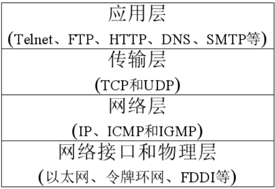
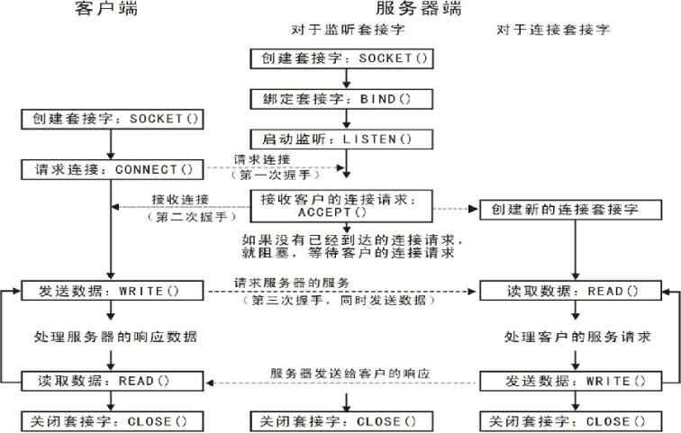

# 网络编程
基础理论: IP、子网掩码、网络协议、端口号、协议模型
socket: TCP  UDP模型、组播、广播、抓包工具、并发服务器
数据库: sqlite3-ubuntu
Modbus协议、HTTP协议、WebServer

项目: ftp、基于WebServer的工业数据采集项目

学习方法：
1. 记忆知识点主要先记大框架，再记里面的细节（代码晚自习3遍起）
2. 按照框架和流程写代码
3. 对于一些需要记忆的内容，提炼关键字
4. 节奏保持一致，不要错位
5. 代码量比较大，出现问题首先自己排查（错题集）
6. 重点在逻辑，代码可能会需要大量复制（备份）
7. 项目重点先梳理项目框架，不只是机械性出结果
# 1.认识网络
网络：多设备通信
https://docs.qq.com/doc/DWXd3cGFBck9zcXBI 

# 2.IP地址
## 2.1. 基本概念
● IP地址是Internet中主机的标识(电脑本身还自带一个物理的标识，需区分)
● Internet中的主机要与别的机器通信必须具有一个IP地址
● IP地址为32位（IPv4）或者128位（IPv6）
● 每个数据包都必须携带目的IP地址和源IP地址，路由器依靠此信息为数据包选择路由
● 表示形式：常用点分十进制形式，如202.38.64.10，最后都会转换为一个32位的无符号整数。

## 2.2. 二级划分
IP地址：网络号 + 主机号
IP地址：网络号 + 主机号
网络号：表示是否在同一个网段
主机号：同一个网段内主机ID，并且只能有一个
.jpg>)

A：0.0.0.0 ~ 127.255.255.255
B: 128.0.0.0 ~ 191.255.255.255
C: 192.0.0.0 ~ 233.255.255.255
D: 224.0.0.0 ~ 239.255.255.255
E: 240.0.0.0 ~ 247.255.255.255

## 2. 3. 特殊地址
特殊的IP地址：不能分配给主机使用
1. 网络地址：用于标识网络的起始地址， 有效网络号+全是0的主机号
192.168.50.10	---->   192.168.50.0
128.3.10.7		---->	128.3.0.0
20.2.3.5		---->	20.0.0.0
2. 广播地址：用于给局域网内所有主机发送数据使用，有效网络号+全是1的主机号


拓展：
`0.0.0.0用于服务器中, 0.0.0.0指的是监听本机上所有的IPV4地址`
接受来自任意源IP地址的数据包，常用于服务器程序监听所有网络接口的连接请求。

`127.0.0.1:回环地址/本机地址,一般用来测试使用,所有发往该类地址的数据包都应该被loop back`
`原样送回; `
当在计算机上访问 127.0.0.1 时，实际上是在与自己进行网络通信
练习：C类地址，同一网段最多可以连接多少个主机？
256-2 = 254
## 2. 3. 子网掩码
作用：将IP划分成网络地址和主机地址
特点：
1) 子网掩码长度是和IP地址长度完全一样的，32bit的二进制数组成；
2) 网络号全为1,主机号全为0
		A类：255.0.0.0
		B类：255.255.0.0
		C类：255.255.255.0

练习： 子网掩码255.255.255.0，该网段可以容纳多少台主机？
254

## 2. 4. 三级划分
二级地址 = 网络号+主机号
`三级划分 = 网络号 + 子网号 + 主机号`

练习：
某公司有四个部门：行政、研发1、研发2、营销，每个部门各40台计算机接入公司局域网交换机，如果要在192.168.1.0网段为每个部门划分子网，子网掩码应该怎么设置，每个子网的地址范围分别是什么？（4个部门之间不能通信）

划分4个子网  --->  分2位子网 --->  子网掩码？
子网掩码：255.255.255.192
按照子网号，进一步写出每一个子网的IP地址范围即可
00		192.168.1.1		~	192.168.1.62
01		192.168.1.65	~	192.168.1.126
10		192.168.1.129	~	192.168.1.190
11		192.168.1.193	~	192.168.1.254
# 3.网络模型
## 3.1. 网络的体系结构
● 网络采用分而治之的方法设计，将网络的功能划分为不同的模块，以分层的形式有机组合在一起。
● 每层实现不同的功能，其内部实现方法对外部其他层次来说是透明的。`每层向上层提供服务，同时使用下层提供的服务`
● `网络体系结构即指网络的层次结构和每层所使用协议的集合`
● 两类非常重要的体系结构：OSI与`TCP/IP`

## 3.2. OSI模型
OSI模型是最理想的模型
物理层:传输的是bit流(0与1一样的数据)，物理信号，没有格式
链路层:格式变为帧(把数据分成包，一帧一帧的数据进行发送)
网络层:路由器中是有算法的，ip,(主机到主机)(路由的转发)
传输层:端口号，数据传输到具体那个进程程序(端到端)
会话层:通信管理，负责建立或者断开通信连接
表示层:确保一个系统应用层发送的消息可以被另一个系统的应用层读取，编码转换，数据解析，管理数据加密，解密;
应用层:指定特定应用的协议，文件传输，文件管理，电子邮件等
## 3.3. TCP/IP模型

网络接口和物理层：屏蔽硬件差异（驱动），向上层提供统一的操作接口。
网络层：提供端对端的传输，可以理解为通过IP寻址机器。
传输层：决定数据交给机器的哪个任务（进程）去处理，通过端口寻址
应用层：应用协议和应用程序的集合
## 3.4. 常见网络协议
```
网络接口和物理层:
    PPP:拨号协议(老式电话线上网方式)
    ARP:地址解析协议 IP-->MAC
    RARP:反向地址转换协议 MAC-->IP
网络层:
    IP(IPV4/IPV6):网间互连的协议
    ICMP:网络控制管理协议，ping 命令使用
    IGMP:网络分组管理协议，广播和组播使用
传输层:
    TCP:传输控制协议
    UDP:用户数据报协议
应用层:
    SSH:加密协议
    telnet:远程登录协议
    FTP:文件传输协议(TCP)
    TFTP：简单文件传输协议（UDP）
    HTTP:超文本传输协议（明文发送）HTTPS加密传输
    DNS:域名解析协议
    SMTP/POP3:邮件传输协议

```
# 4.TCP和UDP
UDP TCP 协议相同点：`都存在于传输层`
TCP:传输控制协议
`TCP`(Transmission Control Protocol)是一种`面向连接`的传输层协议，它能提供高`可靠性通信`(即`数据无误、数据无丢失、数据无失序、数据无重复到达`的通信)
```
高可靠性原因：
三次握手、四次挥手
序列号和应答机制
超时、错误重传机制
拥塞控制、流量控制（滑动窗口）

```
适用情况：
1、适合于对传输质量要求较高，以及传输大量数据的通信。
2、在需要可靠数据传输的场合，通常使用TCP协议
3、MSN/QQ等即时通讯软件的用户登录账户管理相关的功能通常采用TCP协议
缺点：
发送量较大，效率低
·······················································································································································································
UDP ：用户数据报协议
UDP (User Datagram Protocol) 用户数据报协议，是不可靠的无连接的协议。在数据发送前，因为不需要进行连接，所以可以进行高效率的数据传输。
```
适用情况:
1.发送小尺寸数据(如对DNS服务器进行IP地址查询时)
2.在接收到数据，给出应答较困难的网络中使用UDP。
3.适合于广播/组播式通信中。
4.MSN/QQ/skype 等即时通讯软件的点对点文本通讯以及音视频通讯通常采用UDP协议
5.流媒体、VOD、VoIP、IPTV等网络多媒体服务中通常采用UDP方式进行实时数据传输
```
```
补充：Dos(拒绝式服务)攻击？
DOS:即 Denial of service，拒绝服务的缩写，拒绝服务，Dos 攻击即攻击者想办法让目标机器停止提供服务或资源访问，这些资源包括磁盘空间、内存、进程甚至网络带宽,从而阻止正常用户的访问。
要对服务器实施拒绝服务攻击，主要有以下两种方法:
1. 迫使服务器的缓冲区满，不接收新的请求;
2. 使用IP欺骗,迫使服务器把合法用户的连接复位,影响合法用户的连接，这也是Dos攻击实施的基本思想。为便于理解，以下介绍一个简单的Dos攻击基本过程:攻击者先向受害者发送大量带有虚假地址的请求，受害者发送回复信息后等待回传信息。由于是伪造地址，所以受害者一直等不到回传信息，分配给这次请求的资源就始终不被释放。当受害者等待一定时间后，连接会因超时被切断，此时攻击者会再度传送一批伪地址的新请求，这样反复进行直至受害者资源被耗尽，最终导致受害者系统瘫痪。
```
# 5.编程预备知识
## 5.1. socket 套接字
### 5.1.1. socket 简介
```
1》1982 - Berkeley software Distributions操作系统引入了socket作为本地进程之间通信的接口
2》1986 - Berkeley扩展了socket接口，使之支持UNIX下的TCP/IP 通信
3》现在很多应用(FTP，Telnet)都依赖这一接口
 
socket
  1、是一个编程接口
  2、是一种特殊的文件描述符(everything in unix is a file)
  3、并不仅限于TCP/IP协议
  4、面向连接(Transmission control Protocol - TCP/IP)
  5、无连接(User Datagram Protocol -UDP和Inter-network Packet Exchange- IPX)
 
为什么需要socket?
     普通的IO操作过程:
     打开文件->读/写操作―>关闭文件
TCP/IP协议被集成到操作系统的内核中，引入了新型的"IO"操作
进行网络通信的两个进程在不同的机器上，如何连接?
网络协议具有多样性，如何进行统一的操作
 需要一种通用的网络编程接口: socket
```
### 5.1.2. socket类型
1) 流式套接字(SOCK_STREAM)   TCP
提供了一个面向连接、可靠的数据传输服务，数据无差错、无重复的发送且按发送顺序接收。内设置流量控制，避免数据流淹没慢的接收方。数据被看作是字节流，无长度限制。
2) 数据报套接字(SOCK_DGRAM)  UDP
提供无连接服务。数据包以独立数据包的形式被发送，不提供无差错保证，数据可能丢失或重复，顺序发送，可能乱序接收。
3) 原始套接字(SOCK_RAW)
可以对较低层次协议如IP、ICMP直接访问。
## 5.2. 端口号
● 为了区分一台主机接收到的数据包应该`转交给哪个进程来进行处理`，使用端口号来区分
● `TCP端口号与UDP端口号独立`
● 端口号一般由IANA (Internet Assigned Numbers Authority) 管理
● 端口用两个字节来表示 `2byte`

```
众所周知端口：1~1023（1~255之间为众所周知端口，256~1023端口通常由UNIX系统占用）
已登记端口：1024~49151    （选1000以上10000以下） 8888  8000 9999
动态或私有端口：49152~65535

```
## 5.3. 字节序
1. 字节序是指不同类型的cpu主机，内存存储 "`多字节整数`" 序列的方式
2. 浮点类型，字符类型，字符串没有字节序。
3. 小端序（little-endian） - 低序字节存储在低地址 (主机字节序)
4. 大端序（big-endian）- 高序字节存储在低地址 (网络字节序)

### 5.3.1. 主机字节序到网络字节序

```c
u_long htonl(u_long hostlong);
 
u_short htons(u_short short);//掌握这个

```
### 5.3.2. 网络字节序到主机字节序
```c
u_long ntohl(u_long hostlong);
 
u_short ntohs(u_short short);

```
5.4. IP地址转换
man inet_addr
```c
typedef uint32_t in_addr_t;
struct in_addr
{
    in_addr_t s_addr;
};

in_addr_t inet_addr(const char *ip);//从人看的IP地址转换为机器使用的32位无符号整数
char *inet_ntoa(struct in_addr in);//从机器到人

```
# 6.TCP编程
B/S：浏览器和服务器通信的架构		C/S：客户端和服务器端通信的架构

## 6.1. 流程

```c

服务器：
1.创建流式套接字（socket()）------------------------>  有手机
2.指定本地的网络信息（struct sockaddr_in）----------> 办电话卡
3.绑定套接字（bind()）---------------------------->将电话卡插入手机
4.监听套接字（listen()）---------------------------->待机
5.链接客户端的请求（accept()）---------------------->接电话
6.接收/发送数据（recv()/send()）-------------------->通话
7.关闭套接字（close()）----------------------------->挂机

客户端：
1.创建流式套接字（socket()）----------------------->有手机
2.指定服务器的网络信息（struct sockaddr_in）------->有对方号码
3.请求链接服务器（connect()）---------------------->打电话
4.发送/接收数据（send()/recv()）------------------->通话
5.关闭套接字（close()）--------------------------- >挂机

```

## 6.2. 函数接口
### 6.2.1. socket

```c
#include <sys/types.h>          /* See NOTES */
#include <sys/socket.h>
 
int socket (int domain,int type, int protocol) ;
功能:创建套接字
参数:
    domain:协议族
        AF_UNIX,AF_LOCAL      本地通信
        AF_INET                ipv4
        AF_INET6               ipv6
    type:套接字类型
        SOCK_STREAM:流式套接字
        SOCK_DGRAM:数据报套接字
        SOCK_RAW:原始套接字
    protocol:协议–填0自动匹配底层，根据type系统默认自动帮助匹配对应协议
            传输层:IPPROTO_TCP、IPPROTO_UDP、IPPROTO_ICMP
            网络层: htons (ETH_P_IP|ETH_P_ARP|ETH_P_ALL)
返回值:
        成功      文件描述符
        失败      -1，更新errno

```
### 6.2.2. bind
```c
#include <sys/types.h>          /* See NOTES */
#include <sys/socket.h>
 
int bind (int sockfd,const struct sockaddr * addr ,socklen t addrlen) ;

功能:绑定
参数:
    socket:套接字
    addr:用于通信结构体 (提供的是通用结构体，需要根据选择的通信方式，填充对应
结构体--通信方式由当时socket第一个参数确定) 
    addrlen:结构体大小
返回值:成功0    失败-1,更新errno

通用结构体:
struct sockaddr {
    sa_family_t sa_family;
    char    sa _data [14];
}
IPV4:
struct sockaddr_in 
{
    sa_family_t sin_family; /* 地址族: AF_INET */
    u_int16_t sin_port; /* 按网络字节次序的端口 */
    struct in_addr sin_addr; /* internet地址 */
};

/* Internet地址. */
struct in_addr 
{
    u_int32_t s_addr; /* 按网络字节次序的地址 */
};
```
### 6.2.3. listen
```c
#include <sys/types.h>          /* See NOTES */
#include <sys/socket.h>
 
int listen(int sockfd, int backlog);
功能:监听，将主动套接字变为被动套接字
参数：
 sockfd：套接字
 backlog：同时响应客户端请求链接的最大个数，不能写0.
  不同平台可同时链接的数不同，一般写5，10个
返回值：成功 0   失败-1,更新errno

```
### 6.2.4. accept
```c
#include <sys/types.h>          /* See NOTES */
#include <sys/socket.h>
 
int accept(int sockfd, struct sockaddr *addr, socklen_t *addrlen);
accept(sockfd,NULL,NULL);
阻塞函数，阻塞等待客户端的连接请求，如果有客户端连接，则accept()函数返回，返回一个用于通信的套接字文件;
参数：
   Sockfd ：套接字
   addr： 链接客户端的ip和端口号
      如果不需要关心具体是哪一个客户端，那么可以填NULL;
   addrlen：结构体的大小
     如果不需要关心具体是哪一个客户端，那么可以填NULL;
  返回值： 
     成功：文件描述符; //用于通信
    失败：-1，更新errno
```
###  6.2.5. recv
```c
ssize_t recv(int sockfd, void *buf, size_t len, int flags);
功能: 接收数据 
参数： 
    sockfd：用于通信的文件描述符
    buf  存放位置
    len  大小
    flags  一般填0，相当于read()函数
        MSG_DONTWAIT  非阻塞
返回值： 
   < 0  失败出错  更新errno
   ==0  表示客户端退出
   >0   成功接收的字节个数

```
### 6.2.6. send
```c
ssize_t send(int sockfd, const void *buf, size_t len, int flags);
功能：发送数据
参数：
    sockfd:用于通信的文件描述符
    buf：发送内容存放的地址
    len：发送内存的长度
    flags：如果填0，相当于write();

```
### 6.2.7. connect
```c
int connect(int sockfd, const struct sockaddr *addr,socklen_t addrlen);
功能：用于连接服务器；
参数：
     sockfd：socket函数的返回值
     addr：填充的结构体是服务器端的；
     addrlen：结构体的大小
返回值 
      -1 失败，更新errno
      正确 0

```