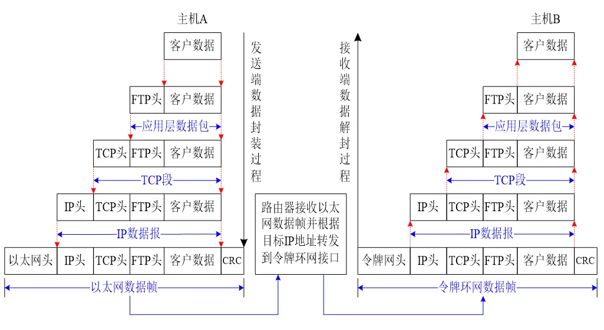
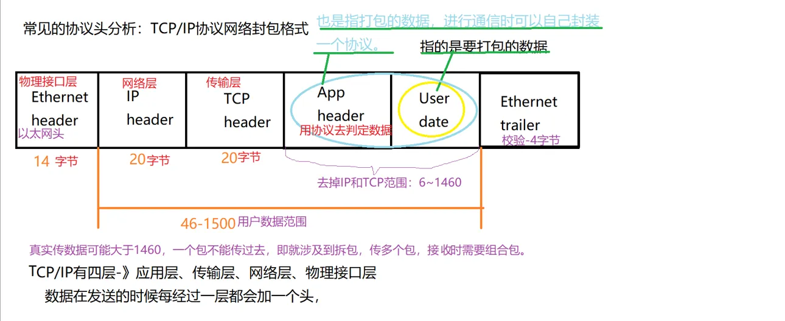
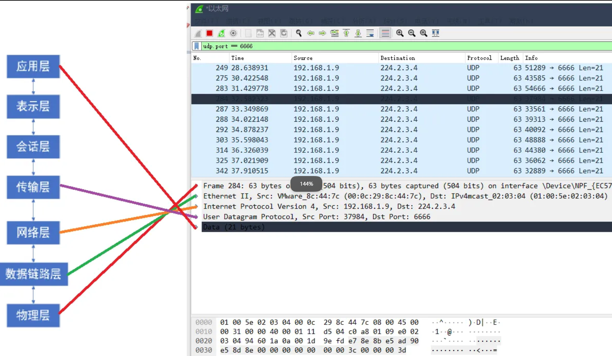
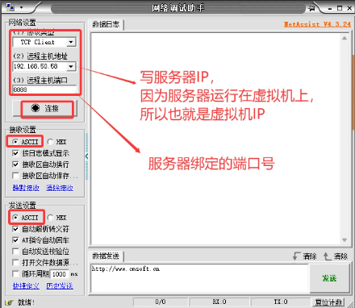
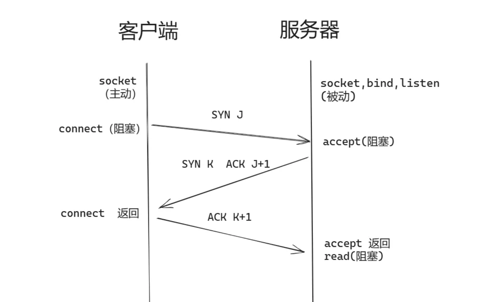
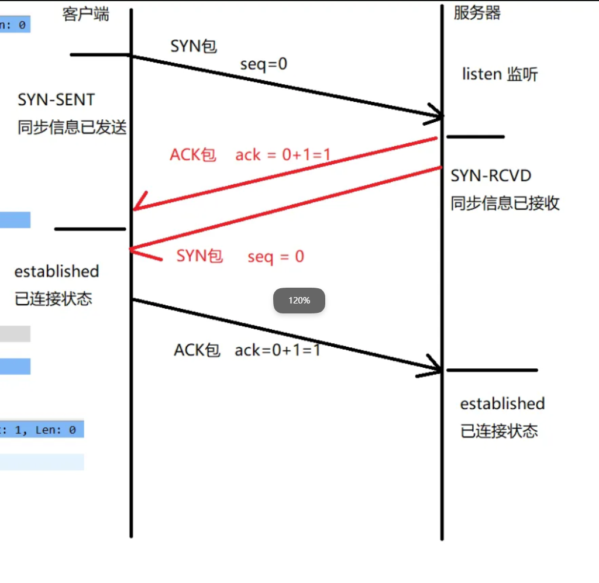
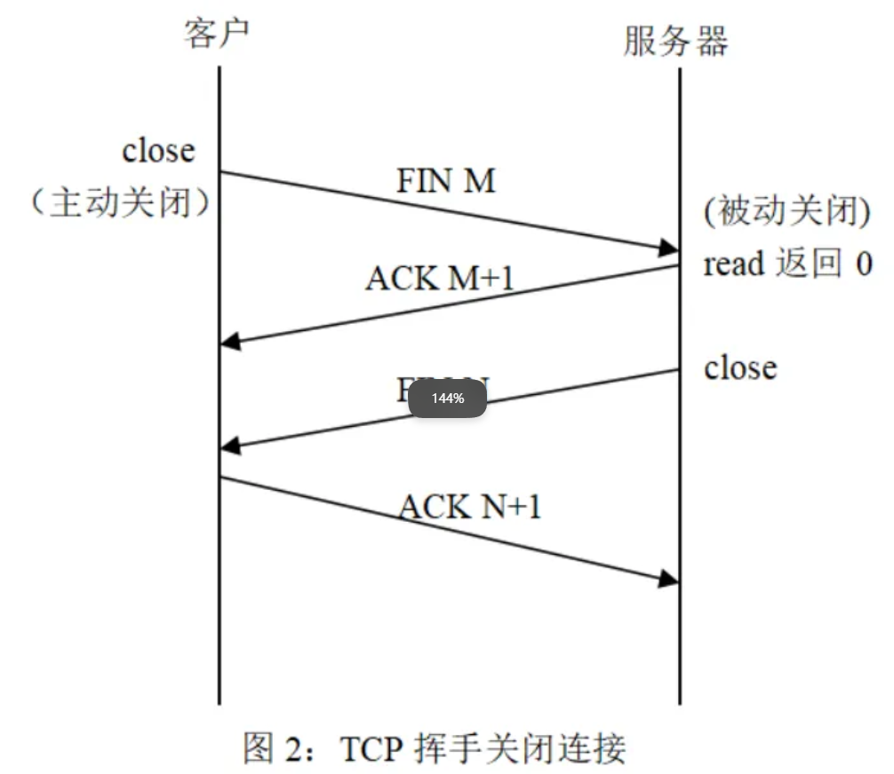
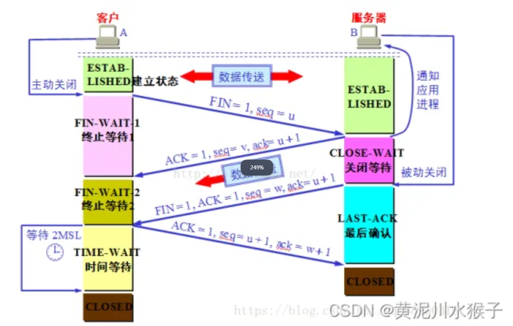

day3
# 服务器模型
并发服务器
IO多路复用实现并发服务器(重点)
TCP同时连接多个客户端(同时检测两个事件：键盘事件、客户端连接事件)
.jpg>)

# 1.网络调试
## ping
作为平时网络连通检测使用最多的命令，它的作用主要为：
● 用来检测网络的连通情况；
● 根据域名得到服务器IP；
● 根据ping返回的TTL值来判断数据包经过路由器数量。
.jpg>)
## netstat
作用：测试网络状态
netstat -a //查看所有网络连接状态
netstat -at //查看tcp所有网络状态
netstat -au //查看udp所有网络状态
.jpg>)
# 2.网络协议头分析
## 2.1. 数据的封装、传递过程

## 2.2. 以太网帧完成帧格式

● 对于网络层最大数据帧长度是1500字节
● 对于链路层最大数据长度是1518字节（1500+14+CRC）
● 发送时候，IP层协议栈程序检测到发送数据和包头总长度超过1500字节时候，会进行自动分包处理，接收端在IP层进行包重组，然后才继续往上传递
## 2.3. wireshark 的使用
### 2.3.2. wireshark抓包
开始界面
#### 1.wireshark是捕获机器上的某一块网卡的网络包，当你的机器上有多块网卡的时候，你需要选择一个网卡。
#### 2.双击需要的网卡，开始抓包
		捕获器选择：
		windows如果连接有线网络，选择本地连接/以太网
		 	如果连接无线网络，选择WLAN
				如果只是在本机上的通信，选择NPCAP Loopback apdater
或Adapter for loopback traffic capture
过滤条件：
			过滤端口：tcp.port == 520
			过滤IP：ip.addr == 192.168.0.105（自己的ip地址）
		以上条件同时过滤，通过&&连接
#### 3.wireshark与对应的OSI七层模型

可以打开网络调试助手，进行测试
首先运行虚拟机的服务器
然后打开网络调试助手，设置好之后可以连接

#### 3.三次握手、四次挥手
##### 三次握手：

第一次握手：客户端发送SYN同步包（SYN =1,seq=J ）,客户端会进入SYN_SENT状态，等待服务器端返回确认信息。
第二次握手：服务器接受到客户端的SYN包后，确认客户端的SYN包，发送ACK确认包（ACK=1，ack=J+1）,同时发送一个SYN包（SYN=1,seq=K）,进入SYN_RCVD状态。
第三次握手：客户端收到服务器端的SYN包及ACK包，进入ESTABLISHED状态，同时会向服务器发送一个ACK确认包（ACK=1，ack=K+1）,此时三次握手包发送完毕，服务器端收到ACK后，进入ESTABLISHED状态。

##### 四次挥手：


第一次挥手：主动方发送一个FIN包（FIN=1,seq=M）给被动方，进入FIN_WAIT_1状态。
第二次挥手：被动方接收到FIN包，给主动方发送一个ACK确认包（ACK=1，ack=M+1）；进入CLOSE_WAIT状态。主动方接收到ACK包后，进入FIN_WAIT_2状态。
第三次挥手:被动方发送一个FIN包（FIN=1,seq=N）,并进入LAST_ACK状态。
第四次挥手：主动方接收到FIN包，回复一个ACK包（ACK=1,ack=N+1）,进入TIME_WAIT状态，被动方收到ACK后，关闭连接，进入CLOSE状态，主动方TIME_WAIT时间结束后进入CLOSE状态。

```
为什么客户端在TIME-WAIT阶段要等2MSL？
为的是确认服务器端是否收到客户端发出的 ACK 确认报文，当客户端发出最后的 ACK 确认报文时，并不能确定服务器端能够收到该段报文。
 
所以客户端在发送完 ACK 确认报文之后，会设置一个时长为 2MSL 的计时器。
MSL 指的是 Maximum Segment Lifetime：一段 TCP 报文在传输过程中的最大生命周期。
2MSL 即是服务器端发出为 FIN 报文和客户端发出的 ACK 确认报文所能保持有效的最大时长。
 
服务器端在 1MSL 内没有收到客户端发出的 ACK 确认报文，就会再次向客户端发出 FIN 报文：
如果客户端在 2MSL 内，再次收到了来自服务器端的 FIN 报文，说明服务器端由于各种原因没有接收到客户端发出的 ACK 确认报文。客户端再次向服务器端发出 ACK 确认报文，计时器重置，重新开始 2MSL 的计时。
否则客户端在 2MSL 内没有再次收到来自服务器端的 FIN 报文，说明服务器端正常接收了 ACK 确认报文，客户端可以进入 CLOSED 阶段，完成“四次挥手”。
 
所以，客户端要经历时长为 2SML 的 TIME-WAIT 阶段;这也是为什么客户端比服务器端晚进入 CLOSED 阶段的原因。


```

TCP如何保证可靠性传输？
1. 通过三次握手建立可靠连接
2. 通过应答确认机制和重传机制确认数据准确到达，通过给数据增加序列号，确保数据到达不失序
3. 通过四次挥手实现断开连接时数据的完整性
```
发生TCP粘包或拆包有很多原因，常见的几点： 
1、要发送的数据大于TCP发送缓冲区剩余空间大小，将会发生拆包。 
2、待发送数据大于MSS（最大报文长度），TCP在传输前将进行拆包。 
3、要发送的数据小于TCP发送缓冲区的大小，TCP将多次写入缓冲区的数据一次发送出去，将会发生粘包。 
4、接收数据端的应用层没有及时读取接收缓冲区中的数据，将发生粘包。
 
方法：
解决问题的关键在于如何给每个数据包添加边界信息，常用的方法有如下：
 1、发送端给每个数据包添加包首部，首部中应该至少包含数据包的长度，这样接收端在接收到数据后，通过读取包首部的长度字段，便知道每一个数据包的实际长度了。 
2、发送端将每个数据包封装为固定长度（不够的可以通过补0填充），这样接收端每次从接收缓冲区中读取固定长度的数据就自然而然的把每个数据包拆分开来。 
3、可以在数据包之间设置边界，如添加特殊符号，这样，接收端通过这个边界就可以将不同的数据包拆分开。 等等。
4.延时、效率低

```

# 关于三次握手、四次挥手需要理解和背过的deepseek的描述
## 描述
三报文握手（Three-way Handshake）：建立连接。

客户端向服务器发送SYN报文（同步序列号，SYNchronize Sequence Number），客户端由CLOSED状态进入SYN-SENT状态。
服务器收到SYN后，回复SYN+ACK报文（同步并确认），服务器由LISTEN状态进入SYN-RCVD状态。
客户端收到SYN+ACK后，发送ACK报文（确认），客户端进入ESTABLISHED状态。服务器收到该ACK后也进入ESTABLISHED状态，连接建立。


四报文挥手（Four-way Handshake）：释放连接。由于TCP连接是全双工的，每个方向需单独关闭。

主动关闭方发送FIN报文（结束，Finish），进入FIN-WAIT-1状态。
被动关闭方收到FIN后，回复ACK报文（确认），进入CLOSE-WAIT状态。主动方收到ACK后进入FIN-WAIT-2状态。此时，主动方到被动方的连接已关闭，但被动方仍可发送数据。
被动关闭方应用层调用关闭后，向主动方发送FIN报文，进入LAST-ACK状态。
主动方收到FIN后，回复ACK报文，进入TIME-WAIT状态（等待2倍最大报文段生存时间）。被动方收到ACK后立即进入CLOSED状态，主动方等待计时器超时后也进入CLOSED状态。
## 理解
1. SYN（Synchronize，同步）
含义：请求建立连接并同步初始序列号。
什么时候发、怎么发：
客户端在发起连接时，调用 connect()，内核协议栈会构造一个 TCP 报文，把 SYN 标志位置为 1，同时带上一个随机的初始序列号 x（比如 seq = x）。
这个报文就是 SYN 报文，它的作用就是告诉服务器：“我想和你建立连接，我的初始序号是 x，请同步。”
为什么叫“同步”：因为 TCP 是通过序列号来保证可靠传输的，连接建立的第一步就是交换双方的初始序列号，让两端的“计数”对齐。
2. ACK（Acknowledgment，确认）
含义：确认收到数据，并告知对方期望的下一个字节的序列号。
什么时候发、怎么发：
ACK 可以在几乎所有报文里捎带，只要 TCP 头部里的 ACK 标志位置为 1 即可。
比如服务器收到客户端的 SYN 报文后，要回复一个 SYN+ACK 报文，这个报文里 SYN=1 且 ACK=1，同时确认号字段 ack = x + 1，意思是“你的 SYN 我收到了，我期望你下一个发来的字节序号是 x+1”。
在数据传输过程中，每收到一个数据包，接收方都会回复一个 ACK 报文（或者把 ACK 捎带在回复数据里），确认已经收到了哪些字节。
3. FIN（Finish，结束）
含义：请求关闭连接（数据发送完毕）。
什么时候发、怎么发：
当应用程序调用 close() 时，内核协议栈会构造一个 TCP 报文，把 FIN 标志位置为 1，发送给对方。
这个报文就是 FIN 报文，作用是告诉对方：“我这边的数据发完了，我想关闭我这个方向的连接。”
4. RST（Reset，重置）
含义：强制断开连接，通知对方异常。
什么时候发、怎么发：
当收到一个不合法或无法处理的报文时（比如连到一个没有被监听的端口），内核会直接回复一个 RST 报文（RST=1），告诉对方“这个连接不存在”或“连接已经死掉了”。
你之前遇到的 Connection refused，就是对方发回了 RST 报文；Connection reset by peer 也是收到了 RST。
5. PSH（Push，推送）
含义：催促接收方尽快把数据交给应用程序，不要只放在缓冲区里。
什么时候发、怎么发：
发送端调用 send() 后，可以在报文里设置 PSH=1，告诉接收方：“这个报文别缓存了，赶紧把数据交给应用程序。”
很多实现中，send 后会自动设置 PSH，一般不用程序员手动处理。
6. URG（Urgent，紧急）
含义：标记紧急数据。
什么时候发、怎么发：
如果报文里设置了 URG=1，并且“紧急指针”字段有效，表示这个报文里包含需要优先处理的紧急数据（比如带外数据）。日常编程极少用到。


