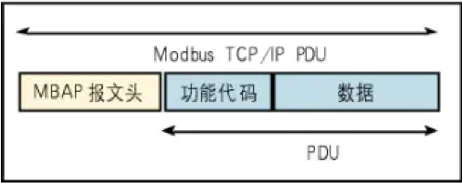
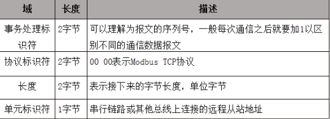
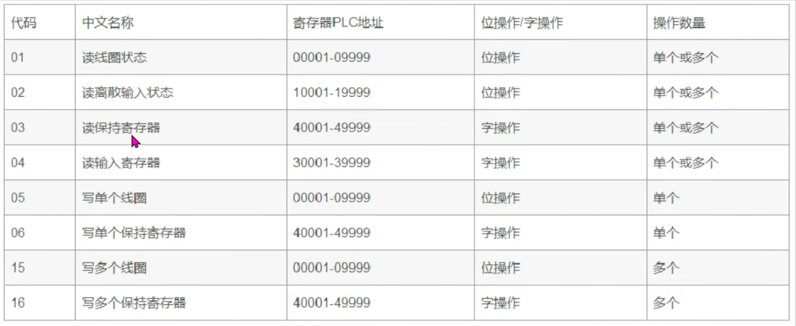
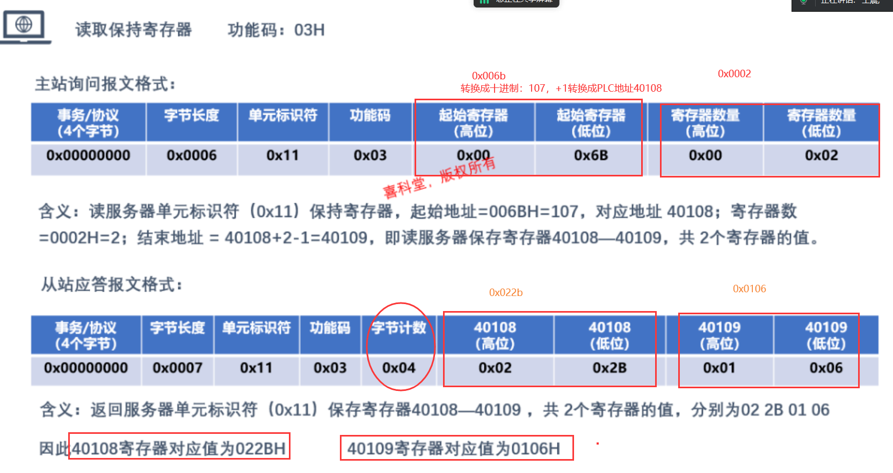

# 库
## 1.1. 数据库的概念
数据库是“按照数据结构来组织、存储和管理数据的仓库”。是一个长期存储在计算机内的、有组织的、可共享的、统一管理的大量数据的集合。
数据库是存放数据的仓库。它的存储空间很大，可以存放百万条、千万条、上亿条数据。但是数据库并不是随意地将数据进行存放，是有一定的规则的，否则查询的效率会很低。当今世界是一个充满着数据的互联网世界，充斥着大量的数据。即这个互联网世界就是数据世界。数据的来源有很多，比如出行记录、消费记录、浏览的网页、发送的消息等等。
## 1.2. 数据库的分类
```c
常用的数据库
大型数据库 ：Oracle
    商业、多平台、关系型数据库
    功能最强大、最复杂、市场占比最高的商业数据库
中型数据库 ：Server是微软开发的数据库产品，主要支持windows平台 
小型数据库 : mySQL是一个小型关系型数据库管理系统。开放源码、目前使用最广泛、流行度最高的的开源数据库
 
SQLite基础
 SQLite的源代码是C，其源代码完全开放。它是一个轻量级的嵌入式数据库。
 SQLite有以下特性： 
     	零配置————无需安装和管理配置； 
     	储存在单一磁盘文件中的一个完整的数据库； 
     	数据库文件可以在不同字节顺序的机器间自由共享； 
     	支持数据库大小至2TB（1024 G = 1 TB）；足够小，全部源码大致3万行c代码，250 KB； 
        比目前流行的大多数数据库对数据的操作要快；
 
创建SQLite数据库：
1 手工创建 
     使用sqlite3工具，通过手工输入SQL命令行完成数据库创建. 
     用户在Linux的命令行界面中输入sqlite3可启动sqlite3工具 
2 代码
在代码中常动态创建数据库 在程序运行过程中，当需要进行数据库操作时，应用程序会首先尝试打开数据库，此时如果数据库并不存在，程序则会自动建立数据库，然后再打开数据库


```
## 1.3. 基础SQL语句使用
【腾讯文档】sqlite基础SQL语句使用
https://docs.qq.com/doc/DWXBmVWtKd2NLSkVH 

## 1.4. API接口文档    数据库接口文档
官方文档：https://www.sqlite.org/c3ref/funclist.html
中文文档：http://doc.yonyoucloud.com/doc/wiki/project/sqlite/sqlite-commands.html
```c
头文件：#include <sqlite3.h>
编译：gcc xxx.c -lsqlite3
 
1. int sqlite3_open(char  *path, sqlite3 **db);
 
功能：打开sqlite数据库，如果数据库不存在则创建它
path： 数据库文件路径
db： 指向sqlite句柄的指针
返回值：成功返回SQLITE_OK，失败返回错误码(非零值)
 
2. int sqlite3_close(sqlite3 *db);
 
功能：关闭sqlite数据库
返回值：成功返回SQLITE_OK,失败返回错误信息
 
3.返回sqlite3定义的错误信息
char *sqlite3_errmsg(sqlite3 *db);
4.执行sql语句接口
int sqlite3_exec(
  sqlite3 *db,                                  /* An open database */
  const char *sql,                           /* SQL to be evaluated */
  int (*callback)(void*,int,char**,char**),  /* Callback function */
  void *arg,                      /* 1st argument to callback */
  char **errmsg                              /* Error msg written here */
);
 
功能：执行SQL操作
db：数据库句柄
sql：要执行SQL语句
callback：回调函数(满足一次条件，调用一次函数，用于查询)
    再调用查询sql语句的时候使用回调函数打印查询到的数据
arg:传递给回调函数的参数
errmsg：错误信息指针的地址
返回值：成功返回SQLITE_OK，失败返回错误码
 
回调函数：
 int (*sqlite3_callback)(void *para, int f_num, 
         char **f_value, char **f_name);
 
功能：select:每找到一条记录自动执行一次回调函数
para：传递给回调函数的参数（由 sqlite3_exec() 的第四个参数传递而来）
f_num：记录中包含的字段数目
f_value：包含每个字段值的指针数组（列值）
f_name：包含每个字段名称的指针数组（列名）
返回值：成功返回SQLITE_OK，失败返回-1，每次回调必须返回0后才能继续下次回调
 
5.不使用回调函数执行SQL语句(只用于查询)
int sqlite3_get_table(sqlite3 *db, const  char  *sql, 
   char ***resultp,  int *nrow,  int *ncolumn, char **errmsg);
 
功能：执行SQL操作
db：数据库句柄
sql：SQL语句
resultp：用来指向sql执行结果的指针
nrow：满足条件的记录的数目(但是不包含字段名(表头 id name score))
ncolumn：每条记录包含的字段数目
errmsg：错误信息指针的地址
 
返回值：成功返回SQLITE_OK，失败返回错误码

```
编译链接库：sqlite3

# 2.Modbus协议
## 2.1. 起源
Modbus由Modicon公司于1979年开发，是一种工业现场总线协议标准。
Modbus通信协议具有多个变种，其中有支持串口，以太网多个版本，其中最著名的是Modbus RTU、Modbus ASCII和Modbus TCP三种
其中Modbus TCP是在施耐德收购Modicon后1997年发布的。
## 2.2. 分类
1) Modbus RTU
运行在串口上的协议，采用二进制表现形式以及紧凑型数据结构，通信效率高，应用广泛
2) Modbus ASCII
运行在串口上的协议，采用ASCII码传输，并且利用特殊字符作为其字节的开始与结束标识，其传输效率要远远低于Modbus RTU协议，一般只有在通信数据量较小的情况下才考虑使用Modbus ASCII通信协议
3) Modbus TCP
运行在以太网上的协议
## 2.3. 优势
免费、简单、容易使用
## 2.4. 应用场景
Modbus协议是现在国内工业领域应用最多的协议，不只PLC设备，各种终端设备，比如水控机、水表、电表、工业秤、各种采集设备
## 2.5. Modbus TCP特点
1）采用主从问答式通信
2）Modbus TCP协议是应用层协议，基于传输层的TCP协议实现的
3）Modbus TCP端口号默认502
3.Modbus TCP协议格式
ModbusTcp协议包含三部分：报文头、功能码、数据

Modbus TCP/IP协议最大数据帧长度为260字节，报文头7字节，功能码1字节，数据最大252字节。
3.1. 报文头
包含7字节，分别是：

事务处理标识符：没有限制，主机发送什么，从机回复什么
协议标识符：00 00 （十六进制）占2字节，表示Modbus TCP协议
长度：存放的后面字节长度，用4位十六进制表示（2字节）
单元标识符：从机ID

## 3.2. 寄存器
传感器采集数据存到寄存器里，传感器的寄存器可能也就2两个字节。
包含4种：`离散量输入寄存器、线圈寄存器、输入寄存器、保持寄存器`

### 可以分成两类：
位寄存器：
1字节（8位）
作用：控制设备（控制高低电平）
线圈寄存器、离散量输入寄存器
  r   w           r
字寄存器：
2字节
作用：存储数据
保持寄存器、输入寄存器
  r   w        r

1) 离散量和线圈其实就是位寄存器（寄存器数据占1字节），工业上主要用于`控制IO`设备。
线圈寄存器，类比为开关量，每一个bit都对应一个信号的开关状态。所以一个byte就可以同时控制8路的信号。比如控制外部8路io的高低。 线圈寄存器`支持读也支持写`，写在`功能码`里面又分为写单个线圈寄存器和写多个线圈寄存器。
离散输入寄存器，离散输入寄存器就相当于线圈寄存器的`只读模式`，他也是每个bit 表示一个开关量，而他的开关量只能读取输入的开关信号，是不能够写的。比如我读取外部按键的按下还是松开。
2) 输入和保持寄存器是字寄存器（每个寄存器数据占`2个字节`），工业上主要用于`存储工业设备的值`。
保持寄存器，这个寄存器的单位不再是bit而是两个byte，也就是可以存放具体的数据量的，并且是`可读写的`。比如我我设置时间年月日，不但可以写也可以读出来现在的时间。写也分为单个写和多个写
输入寄存器，这个和保持寄存器类似，但是也是`只支持读而不能写`。一个寄存器也是占据两个byte的空间。类比我通过读取输入寄存器获取现在的AD采集值

### 3. 3. 功能码
（背过）
```c
寄存器PLC地址和寄存器的对应关系：
线圈：		  00001-09999
离散量输入：10001-19999
输入寄存器：30001-39999
保持寄存器：40001-49999
```

读：
主机->从机：报文头(7)+功能码(1)+起始地址(2)+数量(2)
从机->主机：报文头(7)+功能码(1)+字节计数(1)+数据(?)

写单个：
主机->从机：报文头(7)+功能码(1)+地址(2)+断通标志/数据(2)

写多个：
主机->从机：报文头(7)+功能码(1)+起始地址(2)+数量(2)+字节计数(1)+数据(?)


