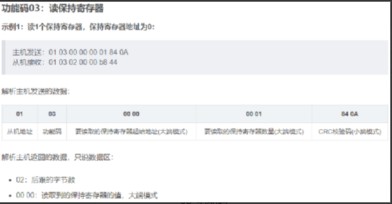

day5
练习：分别封装函数实现对保持寄存器的读取和对单个线圈的控制
考虑函数参数，如何实现功能
函数名（sockfd,slave_id,起始地址，数量，buf,data）
#include <stdio.h>
#include <sys/types.h>
#include <sys/socket.h>
#include <netinet/in.h>
#include <netinet/ip.h>
#include <arpa/inet.h>
#include <unistd.h>
#include <string.h>

// 设置从机id
int set_slave(uint8_t *p, int slave)
{
    p[6] = slave;

    return 0;
}

// 读保持寄存器
int read_registers(int sockfd, uint8_t *p, int addr, int num, uint8_t *pdata)
{
    // 写协议
    p[5] = 0x06;  // 长度
    p[7] = 0x03;  // 功能码
    p[8] = addr >> 8;  // 起始地址(高位)
    p[9] = addr;  // 起始地址(低位)
    p[10] = num >> 8; // 数量(高位)
    p[11] = num; // 数量(低位)

    send(sockfd, p, 12, 0);
    
    recv(sockfd, pdata, 64, 0);
}

// 写线圈
int write_coil(int sockfd, uint8_t *p, int addr, int op, uint8_t *pdata)
{
    // 写协议
    p[5] = 0x06;  // 长度
    p[7] = 0x05;  // 功能码
    p[8] = addr >> 8;  // 地址(高位)
    p[9] = addr;  // 地址(低位)
    if(op == 1)
        p[10] = 0xFF;
    else if(op == 0)
        p[10] = 0x00;
    p[11] = 0x00;

    send(sockfd, p, 12, 0);
    
    recv(sockfd, pdata, 64, 0);
}

int main(int argc, char const *argv[])
{
    // 1. 创建流式套接字
    int sockfd = socket(AF_INET, SOCK_STREAM, 0);
    if (sockfd < 0)
    {
        perror("socket err");
        return -1;
    }

    // 2. 填充服务器结构体信息
    struct sockaddr_in addr;
    addr.sin_family = AF_INET;                         // 协议族
    addr.sin_port = htons(502);                       // 端口号(网络字节序)
    addr.sin_addr.s_addr = inet_addr("192.168.50.65"); // IP地址(32位无符号整数)

    if (connect(sockfd, (struct sockaddr *)&addr, sizeof(addr)) < 0)
    {
        perror("connect err");
        return -1;
    }

    // 4. 接收/发送
    uint8_t buf[12] = {};
    uint8_t data[13] = {};

    set_slave(buf, 1);

    read_registers(sockfd, buf, 0, 2, data);

    for(int i = 0; i < data[8]; i++)
        printf("%d ", data[9+i]);
    printf("\n");

    write_coil(sockfd, buf, 0, 1, data);
    
    // 5. 关闭
    close(sockfd);

    return 0;
}
 

1.Modbus RTU
1.1. 与Modbus TCP的区别
在一般工业场景使用modbus RTU的场景还是更多一些，modbus RTU基于串行协议进行收发数据，包括RS232/485等工业总线协议。
与modbus TCP不同的是RTU没有报文头MBAP字段，但是在尾部增加了两个CRC检验字节（CRC16），因为网络协议中自带校验，所以在TCP协议中不需要使用CRC校验码。
RTU和TCP的总体使用方法基本一致，只是在创建modbus对象时有所不同，TCP需要传入网络socket信息；而RTU需要传入串口相关信息。

1.2. Modbus RTU的特点
Modbus RTU是主从问答协议，由主机发起，一问一答
设置串口参数时要求：
波特率为9600
8位数据位
1位停止位
无流控

1.3. Modbus RTU协议格式
Modbus RTU数据帧包含地址码、功能码、数据、校验码四部分
地址码：1个字节的从机地址码，0：广播地址，1-247：从机地址，248-255：保留。
功能码：与Modbus TCP相同
数据区：数据区包含这么几部分：起始地址、数量、数据，这三项是大端模式
CRC校验：两个字节，校验的数据范围为：地址码+功能码+数据区，校验码的产生可以通过函数自动生成。

1.4. 报文详解
这里我们以03功能码为例重点进行讲解报文
https://blog.csdn.net/qq153471503/article/details/124317894 
以此图为例：
主站询问数据流：01 03 00 00 00 01 84 0A
从左到右依次分析：
01 从机ID
03 功能码
00 00 起始地址
00 01 读取寄存器的个数
84 0A 校验码

从站应答数据流：01 03 02 00 00 b8 44
从左到右依次分析：
01 从机ID
03 功能码
02 数据的个数
00 00 寄存器中的数据
b8 44 校验码

1.5. 模拟器使用
由于实际硬件产品成本较高，我们这里可以使用Modbus软件模拟器，进行数据模拟从而分析Modbus协议。
使用工具：
1. ModbusPoll（模拟主机）和ModbusSlave（模拟从机）
2. vspd虚拟串口
3. UartAssist串口调试工具
设置串口参数要求：波特率为9600 8位数据位 1位停止位 无流控 无校验
虚拟串口的使用：
1.5.1. 虚拟串口的安装
1)将压缩包解压后，双击vspd.exe文件进行安装

2)安装完成后，找到安装目录，将Cracked下的文件复制到软件安装目录
3)打开软件，添加com1和com2端口（用完记得删除端口）

4)添加完端口后，打开设备管理器，这里出现如下图所示即可。

或
1.5.2. 虚拟端口绑定
1)将虚拟机在系统关机（必须是关机状态，挂起不行）状态下，点击虚拟机->设置->硬件->添加串行端口，添加COM1
(第一次默认自动检测，关掉界面重新打开,就能到看到COM1)

2)添加完成后，第一次使用需要将电脑重启
3)重启之后，开启虚拟机，点击虚拟机->可移动设备->串行端口->连接
4)当连接上虚拟串口后，在终端输入dmesg | grep tty，可以查看到对应的设备文件，其中默认的会有ttyS0文件，剩下的就是虚拟串口对应的设备文件

1.5.3. 测试通信
Windows打开串口调试工具，选择好串口COM2->COM1,设置对应的波特率

1.5.4. 在虚拟机运行minicom
在虚拟机安装minicom软件
sudo apt-get install minicom
在终端执行sudo minicom -s
1)选择serial port setup，回车

2)设置设备文件，波特率，关闭流控，按如下图设置（文件改成自己的）

3)修改完成后，回车，保存修改，选择save setup as dfl，敲回车，再次选择exit回车

4)退出后就可以和windows下的串口调试工具进行通信测试

5)也可以在这个界面输入字符，查看串口助手的显示情况。

6)退出：ctrl+A、Z，在弹出的界面里输入X，即可退出。

1.5.5. 将Modbus Slave模拟器作为RTU设备的从机
虚拟机绑定COM1端口，slave连接COM2端口，虚拟机通过编程测试串口通信
	Modbus Slave端的配置如下：

1.5.6. 可能会遇到的问题
1)虚拟串口完成主机与vmware下虚拟机进行串口通信
https://blog.csdn.net/baidu_33232390/article/details/54954931 
2)VSPD虚拟串口工具——从此告别硬件串口调试
https://blog.csdn.net/qq_34202873/article/details/88391265 
3)vmware虚拟机检测不到vspd虚拟串口问题
https://blog.csdn.net/readnap/article/details/116659657 

crc_calc.c(CRC校验函数) crc_calc.h serial_init.c(串口初始化)
写代码实现与slave进行串口通信

#include <stdio.h>
#include "Crc_Calc.h"
#include <sys/types.h>
#include <sys/stat.h>
#include <fcntl.h>
#include <unistd.h>

int main(int argc, char const *argv[])
{
    uint8_t req[8] = {0x01, 0x03, 0x00, 0x00, 0x00, 0x01};
    uint8_t data[32] = {0};
    uint16_t crc;
    // 1. 打开文件
    int fd = open("/dev/ttyS1", O_RDWR);
    if (fd < 0)
    {
        perror("open err");
        return -1;
    }

    // 2. 设置属性
    uart_init(fd);

    // 2. 准备协议，CRC
    crc = GetCRC16(req, 6);
    req[6] = crc >> 8;
    req[7] = crc;

    // 4. 写
    write(fd, req, 8);

    // 5. 读
    read(fd, data, 32);
    for(int i = 0; i < 7; i++)
        printf("%#x ", data[i]);
    printf("\n");

    return 0;
}

注意：编译gcc *.c
	 执行 sudo ./a.out

2.Modbus库
2.1. Modbus安装配置
1)在linux中解压压缩包
将库压缩包复制到linux下，进行解压
		tar -xvf libmodbus-3.1.7.tar.gz
2)进入源码目录，创建文件夹(存放头文件、库文件)
cd libmodbus-3.1.7
	mkdir install 
3)执行脚本configure，进行安装配置（指定安装目录）
		./configure --prefix=$PWD/install
4)执行make和make install
make  //编译
make install  //安装
执行完成后会在install文件夹下生产对应的头文件、库文件文件夹
install：用于存放产生的头文件、库文件等

要想编译方便，可以将头文件和库文件放到系统路径下
sudo cp install/include/modbus/*.h /usr/include 
		sudo cp install/lib/*  -r /lib -d

后期编译时，可以直接gcc xx.c -lmodbus
头文件默认搜索路径：/usr/include 、/usr/local/include
库文件默认搜索路径：/lib、/usr/lib

2.2. 函数接口
modbus_t *  modbus_new_rtu(const char *device, int baud, char parity, int data_bit, int stop_bit);
功能：以RTU方式创建Modbus实例，并初始化
参数：
    device：串口设备路径，
            - Linux 下通常是 /dev/ttyS0, /dev/ttyUSB0,         /dev/ttyAMA0等
            - Windows 下可能是 "COM1", "COM3"等
    baud：  波特率，常见值如：
            9600, 19200, 38400, 57600, 115200
    parity：校验位，取值为以下字符之一：
            - 'N'：无校验（None）
            - 'E'：偶校验（Even）
            - 'O'：奇校验（Odd）
    data_bit：数据位，一般为：
                7 或 8（常用 8）
    stop_bit：停止位，一般为：
                1 或 2（常用 1）
返回值：
    成功：Modbus实例
    失败：返回 NULL，
    
    
int modbus_set_slave(modbus_t *ctx, int slave)
功能：设置从机ID
参数：
    ctx   ：Modbus实例
    slave：从机ID
返回值：成功：0
       失败：-1
       
       
       
int   modbus_connect(modbus_t *ctx)
功能：和从机（slave）建立连接
参数：
    ctx：Modbus实例
返回值：成功：0
       失败：-1
       
       
void   modbus_close(modbus_t *ctx)
功能：关闭文件描述符
参数：ctx：Modbus实例

       
void   modbus_free(modbus_t *ctx)
功能：释放Modbus实例
参数：ctx：Modbus实例
 
 
int modbus_read_bits(modbus_t *ctx, int addr, int nb, uint8_t *dest)
功能：读取线圈状态，可读取多个连续线圈的状态（对应功能码为0x01）
参数：
    ctx   ：Modbus实例
    addr ：寄存器起始地址
    nb    ：寄存器个数
    dest ：得到的状态值
    
int  modbus_read_input_bits(modbus_t *ctx, int addr, int nb, uint8_t *dest)
功能：读取离散量输入状态，可读取多个连续输入的状态（对应功能码为0x02）
参数：
    ctx   ：Modbus实例
    addr ：寄存器起始地址
    nb   ：寄存器个数
    dest ：得到的状态值
返回值：成功：返回nb的值

int  modbus_read_registers(modbus_t *ctx, int addr, int nb, uint16_t *dest)
功能：读取保持寄存器的值，可读取多个连续保持寄存器的值（对应功能码为0x03）
参数：
    ctx   ：Modbus实例
    addr ：寄存器起始地址
    nb    ：寄存器个数
    dest ：得到的寄存器的值
返回值：成功：读到寄存器的个数
       失败：-1
       
int   modbus_read_input_registers(modbus_t *ctx, int addr, int nb, uint16_t *dest)
功能：读输入寄存器的值，可读取多个连续输入寄存器的值（对应功能码为0x04）
参数：
    ctx   ：Modbus实例
    addr ：寄存器起始地址
    nb    ：寄存器个数
    dest ：得到的寄存器的值
返回值：成功：读到寄存器的个数
       失败：-1
       
int  modbus_write_bit(modbus_t *ctx, int addr, int status);
功能：写入单个线圈的状态（对应功能码为0x05）
参数：
    ctx     ：Modbus实例
    addr  ：线圈地址
    status：线圈状态
返回值：成功：1
      失败：-1
      
int  modbus_write_bits(modbus_t *ctx, int addr, int nb, const uint8_t *src);
功能：写入多个连续线圈的状态（对应功能码为15）
参数：
    ctx     ：Modbus实例
    addr  ：线圈地址
    nb     ：线圈个数
    src    ：多个线圈状态
返回值：成功：nb
      失败：-1
      
int  modbus_write_register(modbus_t *ctx, int addr, int value);
功能：  写入单个寄存器（对应功能码为0x06）
参数： 
    ctx    ：Modbus实例
    addr  ：寄存器地址
    value ：寄存器的值 
返回值：成功：1
       失败：-1
       
int  modbus_write_registers(modbus_t *ctx, int addr, int nb, const uint16_t *src);
功能：写入多个连续寄存器（对应功能码为16）
参数：
    ctx    ：Modbus实例
    addr  ：寄存器地址
    nb     ：寄存器的个数
    src    ：多个寄存器的值 
返回值：成功：nb
      失败：-1
 

2.3. 编程流程
1. 创建实例
modbus_new_rtu
2. 设置从机ID
modbus_set_slave
3. 建立连接
modbus_connect
4. 按照功能调用函数
5. 关闭文件描述符
	modbus_close
6. 释放实例
	modbus_free

练习1：通过调用库函数实现03功能码,读两个寄存器的数据打印到终端
作业：
1. 梳理今天所学内容
2. 任务：编程实现采集传感器数据和控制硬件设备（传感器和硬件通过slave模拟）
	传感器：2个，光线传感器、加速度传感器（x\y\z） (四个保持寄存器)
	硬件设备：2个，led灯、蜂鸣器  (两个线圈)
要求：
1. 多任务编程：多线程
2. 循环1s采集一次数据，并将数据打印至终端  (读保存寄存器)
3. 同时从终端输入指令控制硬件设备	(写线圈)
	0  1：led灯打开
	0  0：led灯关闭
		1  1：蜂鸣器开
		1  0：蜂鸣器关
#include <stdio.h>
#include <modbus.h>
#include <pthread.h>
#include <unistd.h>

enum collect
{
    LED,
    BUZ
};

// 采集数据
void *handler_data(void *arg)
{
    modbus_t *rtu = (modbus_t *)arg;
    uint16_t data[4] = {};
    while(1)
    {
        // 读数据
        modbus_read_registers(rtu, 0, 4, data);
        // 打印到终端
        printf("light:%d, x: %d y:%d z:%d\n", data[0], data[1], data[2], data[3]);
        // 睡一秒
        sleep(1);
    }
}

// 控制设备
void *handler_ctl(void *arg)
{
    modbus_t *rtu = (modbus_t *)arg;
    while(1)
    {
        // 输入数据
        int dev, op;
        scanf("%d %d", &dev, &op);
        // 写线圈
        switch (dev)
        {
        case LED:
            modbus_write_bit(rtu, dev, op);
            break;
        
        case BUZ:
            modbus_write_bit(rtu, dev, op);
            break;
        }
    }
}

int main(int argc, char const *argv[])
{
    pthread_t tid1, tid2;
    // 1. 创建Modbus_rtu实例
    modbus_t *rtu = modbus_new_rtu("/dev/ttyS1", 9600, 'N', 8, 1);
    if(NULL == rtu)
    {
        printf("modbus_new_rtu err\n");
    }
    // 2. 设置从机id
    modbus_set_slave(rtu, 1);
    // 3. 建立连接
    if(modbus_connect(rtu) < 0)
    {
        printf("connect err\n");
    }

    // 4. 创建线程
    pthread_create(&tid1, NULL, handler_data, rtu);
    pthread_create(&tid2, NULL, handler_ctl, rtu);

    pthread_join(tid1, NULL);
    pthread_join(tid2, NULL);

    // 5. 关闭文件描述符
    modbus_close(rtu);
    // 6. 释放实例
    modbus_free(rtu);
    return 0;
}
 
课程回放：
录制：白昊天的个人会议室
日期：2026-07-22 09:46:55
录制文件：https://meeting.tencent.com/crm/24Wqzdk4e3 
录制：白昊天的个人会议室
日期：2026-07-22 13:41:58
录制文件：https://meeting.tencent.com/crm/NQoXPYG585 

