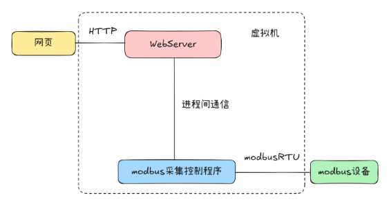

 day6
基于WebServer工业数据采集

1.HTTP协议
1.1. Http简介
HTTP协议是Hyper Text Transfer Protocol（超文本传输协议）的缩写，是用于Web Browser（浏览器）到Web Server（服务器）进行数据交互的传输协议。
HTTP是应用层协议 
HTTP是一个基于TCP通信协议传输来传递数据（HTML 文件, 图片文件, 查询结果等）
HTTP协议工作于B/S架构上，浏览器作为HTTP客户端通过URL主动向HTTP服务端即WEB服务器发送所有请求，Web服务器根据接收到的请求后，向客户端发送响应信息。
HTTP默认端口号为80，但是你也可以改为8080或者其他端口

1.2. Http特点
1)HTTP是无连接：无连接的含义是限制每次连接只处理一个请求。服务器处理完客户的请求，并收到客户的应答后，即断开连接。采用这种方式可以节省传输时间。
2)HTTP是媒体独立的：这意味着，只要客户端和服务器知道如何处理的数据内容，任何类型的数据都可以通过HTTP发送。客户端以及服务器指定使用适合的MIME-type内容类型。
3)HTTP是无状态：HTTP协议是无状态协议。无状态是指协议对于事务处理没有记忆能力。缺少状态意味着如果后续处理需要前面的信息，则它必须重传，这样可能导致每次连接传送的数据量增大。另一方面，在服务器不需要先前信息时它的应答就较快.

1.3. HTTP协议格式
1.3.1. 客户端请求消息格式
客户端发送一个HTTP请求到服务器的请求消息包括以下格式：请求行、请求头部、空行和请求数据四个部分组成，下图给出了请求报文的一般格式。

a)请求行：
请求行是由请求方法字段、url字段、http协议版本字段3个部分组成。请求行定义了本次请求的方式，格式如下：GET /example.html HTTP/1.1(CRLF)。
请求方法：
post 和 get的区别？
GET通常用来从服务器上获得数据，而非修改信息；POST用来向服务器传递数据。
1.请求数据时带参数时；GET请求的数据会附加在URL之后，以?分割URL和传输数据，多个参数用&连接。POST请求会把请求的数据放置在HTTP请求包的包体中。
因此，GET请求的数据会暴露在地址栏中，而POST请求则不会。
2.传输数据的大小；在HTTP规范中，没有对URL的长度和传输的数据大小进行限制。但是在实际开发过程中，对于GET，特定的浏览器和服务器对URL的长度有限制。因此，在使用GET请求时，传输数据会受到URL长度的限制。对于POST，由于不是URL传值，理论上是不会受限制的，但是实际上各个服务器会规定对POST提交数据大小进行限制，Apache、IIS都有各自的配置。
3.GET请求返回的内容可以被浏览器缓存起来。而每次提交的POST，浏览器在你按 下F5的时候会跳出确认框，浏览器不会缓存POST请求返回的内容
4.GET对数据进行查询，POST主要对数据进行增删改！简单说，GET是只读，POST是写
5.对于参数的数据类型，get只接受ASCII字符，而post没有限制。

b)请求头：
也被称作消息报头,请求头是由一些键值对组成，每行一对，关键字和值用英文冒号“:”分隔。允许客户端向服务器发送一些附加信息或者客户端自身的信息，典型的请求头如下:
Accept：作用：描述客户端希望接收的 响应body 数据类型；示例：Accept:text/html
Accept-Charset：作用：浏览器可以接受的字符编码集；示例：Accept-Charset:utf-8
Accept-Language：作用：浏览器可接受的语言；示例：Accept-Language:en
Connection：作用：表示是否需要持久连接，注意HTTP1.1默认进行持久连接；示例：Connection:close
Content-Length：作用：请求的内容长度：示例：Content-Length:348
Content-Type：作用：描述客户端发送的 body 数据类型

c)空行：
最后一个请求头之后是一个空行，发送回车符和换行符，通知服务器以下不再有请求头。

d)请求体：请求数据：
请求数据不在GET方法中使用，而是在POST方法中使用。POST方法适用于需要客户填写表单的场合。与请求数据相关的最常使用的请求头是Content-Type和Content-Length。

1.3.2. 服务器响应消息格式：
HTTP响应也由四个部分组成，分别是：状态行、消息报头、空行和响应正文。
状态行：由三部分组成，HTTP协议的版本号、状态码、以及对状态码的文本描述。例如：HTTP/1.1 200 OK (CRLF) 。（200表示请求已经成功）

200 OK：请求成功，服务器成功处理了请求并返回所请求的资源。
301 Moved Permanently：请求的资源已永久移动到新的URL，客户端应更新其链接。
302 Found：请求的资源暂时移动到新的URL，客户端应继续使用原始URL。
400 Bad Request：服务器无法理解请求的语法，通常是由于客户端发送的请求不正确导致的。
401 Unauthorized：请求要求身份验证，客户端需要提供有效的身份凭证。
403 Forbidden：服务器拒绝请求，客户端没有访问所请求资源的权限。
404 Not Found：请求的资源不存在，服务器无法找到所请求的资源。
500 Internal Server Error：服务器内部错误，无法完成请求的处理。
503 Service Unavailable：服务器当前无法处理请求，通常是由于服务器过载或维护导致的。

2.WebServer
2.1. 简单TCP服务器示例
#include <stdio.h>
#include <stdlib.h>
#include <string.h>
#include <sys/socket.h>
#include <sys/types.h>
#include <netinet/in.h>
#include <unistd.h>
 
#define PORT 8080
#define BUFFER_SIZE 1024
 
void handle_request(int client_socket) {
    char buffer[BUFFER_SIZE];
    char response[] = "HTTP/1.1 200 OK\nContent-Type: text/html\n\n<html><body><h1>Hello, World!</h1></body></html>";
 
    // 从客户端读取请求
    ssize_t bytes_read = read(client_socket, buffer, BUFFER_SIZE - 1);
    if (bytes_read == -1) {
        perror("读取请求失败");
        return;
    }
    buffer[bytes_read] = '\0';
 
    // 打印请求内容
    printf("收到请求:\n%s\n", buffer);
 
    // 发送响应给客户端
    ssize_t bytes_written = write(client_socket, response, strlen(response));
    if (bytes_written == -1) {
        perror("发送响应失败");
    }
}
 
int main() {
    int server_socket, client_socket;
    struct sockaddr_in server_address, client_address;
    socklen_t client_address_len;
 
    // 创建套接字
    if ((server_socket = socket(AF_INET, SOCK_STREAM, 0)) == -1) {
        perror("创建套接字失败");
        exit(1);
    }
 
    // 设置地址重用
    int reuse = 1;
    if (setsockopt(server_socket, SOL_SOCKET, SO_REUSEADDR, &reuse, sizeof(reuse)) == -1) {
        perror("设置地址重用失败");
        exit(1);
    }
 
    // 绑定地址
    server_address.sin_family = AF_INET;
    server_address.sin_port = htons(PORT);
    server_address.sin_addr.s_addr = htonl(INADDR_ANY);
    if (bind(server_socket, (struct sockaddr *)&server_address, sizeof(server_address)) == -1) {
        perror("绑定地址失败");
        exit(1);
    }
 
    // 启动监听
    if (listen(server_socket, 10) == -1) {
        perror("启动监听失败");
        exit(1);
    }
 
    printf("服务器已启动，监听端口 %d\n", PORT);
 
    // 接受连接并处理请求
    while (1) {
        client_address_len = sizeof(client_address);
        if ((client_socket = accept(server_socket, (struct sockaddr *)&client_address, &client_address_len)) == -1) {
            perror("接受连接失败");
            continue;
        }
 
        printf("接受新连接\n");
 
        // 处理请求
        handle_request(client_socket);
        
        // 关闭客户端套接字
        close(client_socket);
        
        printf("连接已关闭\n");
    }
 
    // 关闭服务器套接字
    close(server_socket);
 
    return 0;
}

 
编译
执行
在浏览器输入虚拟机ip:8080 如果成功显示hello world!

2.2. 服务器源码分析
链接：https://pan.baidu.com/s/1PsP8MtZht3dXdlbqFOJaIA?pwd=hqyj 
提取码：hqyj

1. 初始化服务器
2. 循环等待连接，连接后创建线程，调用线程函数msg_request，在函数中调用handler_msg函数分析请求
3. 在handler_msg函数中，先查看请求协议内容，其次获取请求方法、URL、数据，
判断请求方法，对need_handler赋值，确定请求资源路径，如果请求地址没有携带任何资源，则默认返回index.html文件，如果资源不存在，返回404，如果需要处理（get带参数、post）调用handle_request函数，如果不需要（get请求不带参数且资源存在），调用echo_www函数，直接返回资源
4.handle_request函数主要获取post数据，调用parse_and_process函数处理正文内容

3.postman
先用postman检测代码部分有无问题，再写网页实现

作业：
1. 梳理今天所学内容
服务器和浏览器的对应关系
2. postman测试一下，会使用即可

课程回放：
录制：白昊天的个人会议室
日期：2026-07-23 09:05:25
录制文件：https://meeting.tencent.com/crm/lRkqpbr37d 
录制：白昊天的个人会议室
日期：2026-07-23 13:39:38
录制文件：https://meeting.tencent.com/crm/N81qW1A668 

