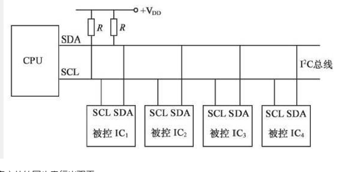
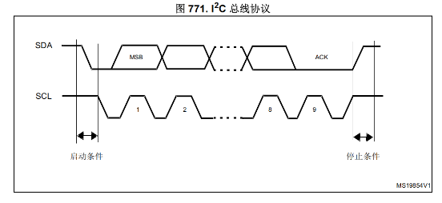
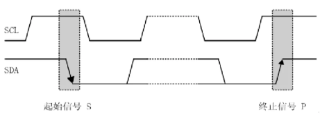
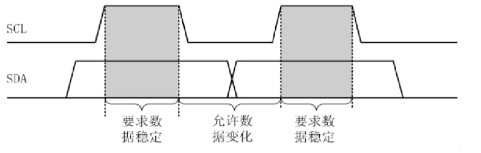
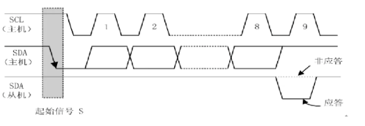

# IIC
## 简单介绍
IIC（Inter-Integrated Circuit）是一个多主从的串行总线，又叫I2C，是由飞利浦公司发明的通讯总线，属于半双工同步传输类型总线。IIC总线是非常常见的数据总线，仅仅使用两条线就能完成多机通讯，一条SCL时钟线，另外一条双向数据线SDA。不同的器件，都是并联接在这两条线上，I2C总线上的每个设备都自己一个唯一的地址，来确保不同设备之间访问的准确性。
SDA(Serial data)是数据线，D代表Data也就是数据，Send Data 也就是用来传输数据的
SCL(Serial clock line)是时钟线，C代表Clock 也就是时钟 也就是控制数据发送的时序的


## 多主从的同步串行半双工
1、当主机没有选择任何从机时，每个从机的SDA口都是输入模式
2、当主机选择完从机，即发送完了地址和操作位时，此时所有未被选中的从机的SDA口配置为高阻态，被选择的从机在读取数据时为输入模式，在发送确认位或者数据时SDA口为输出模式。
## IIC总线上拉电阻的作用
1. 在所有的主机和从机保持空闲的时候，让两条线保持高电平的状态。（空闲阶段）
2. IIC通信采用的是开漏输出的结构，开漏输出是没有办法输出高电平的，所以设备想要输出高电平的话，需要借助外接的上拉电阻（通信阶段）
3. IIC设备输出的高低电平是通过内部的N-mos管的通断所决定的。
```
当设备想要输出逻辑‘0’（低电平）时：
●微控制器会控制N-MOS管的VSS，使其导通（开关闭合）。将IO引脚（也就是SDA或SCL线）直接连接到地（GND）。总线电压被强行拉低至接近0V。
当设备想要输出逻辑‘1’（高电平）时：
●微控制器会控制N-MOS管的VSS，使其关断（开关断开）。此时，设备内部与地之间的通路被彻底切断。设备“放弃”了对总线的控制。处于高阻态，电流从VCC通过上拉电阻流向总线，总线的电平被拉高。

```

4. 实现“线与”逻辑和总线仲裁：
●假设两个设备同时发送数据。设备A想发‘1’（释放总线，MOS管断开），设备B想发‘0’（拉低总线，MOS管导通）。
●由于是“线与”关系，只要有一个设备拉低，总线就是低。
●设备A在发送‘1’的同时，会读取总线实际的状态。它发现自己发送的是‘1’，但读回来的却是‘0’，它就明白有更高优先级的设备正在占用总线，于是主动退出竞争。转为接收模式，这个过程完全由硬件自动完成，无需软件干预。
●如果使用推挽输出，当两个设备一个输出高一个输出低时，就会形成VCC对GND的短路，烧毁芯片。
5. 兼容不同电压的设备：
●总线的高电平由上拉电阻的电源（VCC_pullup） 决定。
●设备1是3.3V系统，它的MOS管最大只能承受3.3V。设备2是5V系统。
我们可以将总线的上拉电源也接到3.3V。这样，当设备2（5V）的MOS管断开时，总线高电平是3.3V，不会超过设备1的耐压值。当设备2拉低时，它只是导通MOS管到地，也不会承受5V到3.3V的压差问题。
●这使得不同工作电压的芯片可以在一条总线上共存。
6. 简化设备设计：
●设备端只需要实现一个简单的NMOS下拉开关，而不需要更复杂的推挽输出级电路。
## IIC特性
通常我们为了方便把IIC设备分为主设备和从设备，基本上谁控制时钟线（控制SCL的电平高低变换）谁就是主设备。
●IIC主设备功能：主要产生时钟，产生起始信号和停止信号
●IIC从设备功能：可编程的IIC地址检测，停止位检测
●IIC的一个优点是它支持多主控(multimastering)，其中任何一个能够进行发送和接收的设备都可以成为主总线。一个主控能够控制信号的传输和时钟频率。当然，在任何时间点上只能有一个主控。
●支持不同速率的通讯速度，标准速度(最高速度100kHZ), 快速（最高400kHZ）
●SCL和SDA都需要接上拉电阻 (大小由速度和容性负载决定一般在3.3K-10K之间) 保证数据的稳定性，减少干扰。
●IIC是半双工，而不是全双工 ，同一时间只可以单向通信，IIC协议首先是发送从机硬件地址，然后发送命令，再发送数据/寄存器编号或者读取数据。IIC协议可以多字节连续读写数据。
●各设备连接到总线的输出端时必须是开漏输出的N-MOS管。
## 时序图分析


## 起始信号和终止信号


1. 当SCL线为高电平期间，SDA线由高电平向低电平发生变化表示起始信号。
2. 当SCL线为高电平期间，SDA线由低电平向高电平发生变化表示终止信号。
3. 起始信号和终止信号都是由主机发出，起始信号产生后，总线处在被占用的状态。
4. 终止信号后，总线处于空闲状态。
## 数据传输时序

1. I2C总线进行数据传送时，时钟信号为高电平期间，数据线上的数据必须保持稳定;    只有在时钟线上的信号为低电平期间，数据线上的高电平或低电平状态才允许变化。
2. 在时钟为低电平期间，发送器向数据线上写入数据，因此数据线上的数据进行变化； 在时钟为高电平期间，接收器从数据线上读取数据，因此必须保持数据线上的数据稳定。 
3. 最终完成一个时钟周期内，发送器发生一个bit位数据，接收器接收一个bit位数据。
## 字节传输和应答信号


1. 每一个字节必须保证是8位的数据长度，数据在传送的时候，优先传输最高位，每一个被传送的字节后面必须跟随一个应答位。
2. 在第9个时钟周期的低电平期间，接收器向数据线上写入数据。
3. 在第9个时钟周期的高电平期间，发送器从数据线上读取数据。    
4. 如果读到的是低电平信号，表示应答信号。
5. 如果读到的是高电平信号，表示非应答信号。
