# STM32（51-01单片机基础）
# 1.前言
## 单片机学习方法
● 先宏观后微观，先原理后应用。
● 最重要的一点：不要钻牛角尖，硬件的学习一定不要钻牛角尖。
● 对电路不要求很了解，看懂就行。
● 学原理学方法
● 由浅入深，项目实践。
总结：理解原理，实时总结，练习实践，应用拓展
## 课程介绍
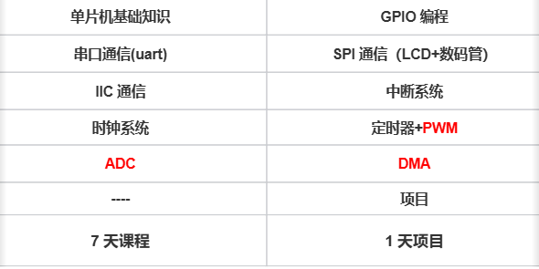
https://hqyj.yuque.com/ckmklb/llnt1k/uomd4g5ly0p74awi?singleDoc# 《硬件课程前置准备》
## 课程要求
上课：专心致志的听课，遇到问题及时与我沟通，课程大纲之外的课程可以沟通，不要耽误课程进度。合理利用AI工具解决问题，但是不要形成依赖。要有自己解决问题的能力。不管学的快还是慢，学的好还是不好，都不要否定自己的能力，相信自己。

作业：每天的内容学习完，生成自己的思维导图（不要复制笔记），作业晚上九点之前完成，拍照发截图或者发视频。
# 2.计算机基础
## 计算机的组成

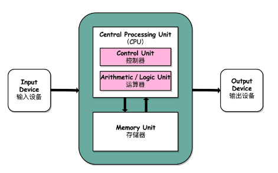

1. 输入设备：将其他信号转换为计算机可以识别的信号（电信号）。                             
2. 输出设备：将电信号（０、１）转为人或其他设备能理解的信号。
3. 运算器：CPU对信息处理和运算的部件，常进行算术运算和逻辑运算，CPU中用各种各样的数字电路搭配成各种各样的运算电路，如：加、减法等。
4. 控制器：整个计算机的指挥中心
5. 存储器：存放程序和数据的部件，也是计算机能够实现“存储程序控制”的基础。
				程序：指令的有序集合
		ROM（Read Only Memery）：掉电不丢失 -硬盘-flash (EMMC)、磁盘空间		掉电不丢失数据，程序存储器
		RAM（RAndom Memery）： 内存、掉电丢失数据,临时数据
# 计算机的三级存储结构

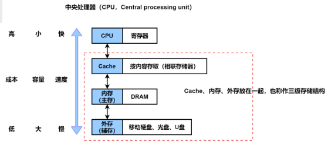

## IO逻辑
	数据的传输在计算机系统中数据的存储，传输，运算都是以二进制的形式进行的。
    数据的传输其实通过数据总线真正传递的是电信号，也就是高低电平。计算机系统中的高低电平逻辑1和0。
## 总线
总线（Bus）是计算机各种功能部件之间传送信息的公共通信干线，它是由导线组成的传输线束， 按照计算机所传输的信息种类，计算机的总线可以划分为数据总线、地址总线和控制总线，分别用来传输数据、数据地址和控制信号。
## 数据总线
（1）是CPU与内存或其他器件之间的数据传送的通道。
（2）数据总线的宽度决定了CPU和外界的数据传送速度。
（3）每条传输线一次只能传输1位二进制数据。如: 8根数据线一次可传送一个8位二进制数据(即一个字节)。
（4）数据总线是数据线数量之和。
## 地址总线
（1）CPU是通过地址总线来指定存储单元的。
（2）地址总线决定了cpu所能访问的最大内存空间的大小。如: 10根地址线能访问的
最大的内存为1024位二进制数据（1024个内存单元）
（3）地址总线是地址线数量之和。
```
举例：比如以八位的数据宽度为例，想要寻找的地址为 0x04,向这个地址中写入 0x66
过程应该是什么样的？
CPU向地址译码器中通过地址总线写入 0000 0100，然后地址译码器就知道我们要寻找的地址为 0x04 ，然后CPU通过数据总线向这个地址写入 0110 0110。
```
## 控制总线
（1）CPU通过控制总线对外部器件进行控制。
（2）控制总线的宽度决定了CPU对外部器件的控制能力。
（3）控制总线是控制线数量之和。

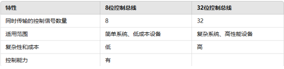

## 总结
数据总线的宽度决定了CPU传输数据的速度（一次传输的数据的最大量）
地址总线的宽度决定了CPU的寻址能力
控制总线决定了对于其他元器件的控制能力
# 3.单片机基础
## 什么是单片机
单片机是单片微型计算机的简称，MCU是Micro controller的简称，也就是嵌入式微控制器。采用集成电路技术将具有数据处理能力的中央处理器CPU、随机存储器RAM、只读存储器ROM、定时器/计时器、多种I/O口和中断系统等功能集成到一块硅片上。可以说单片机就是一个小而完善的微型计算机系统。

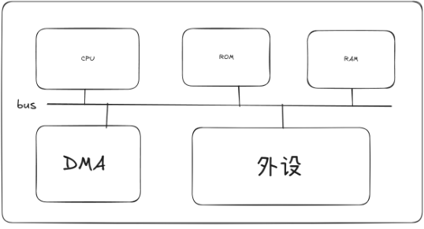

## 单片机型号
### 51单片机(8位)
```
	AT89C51   ATMEL		        STC89C51    宏晶科技STC
```
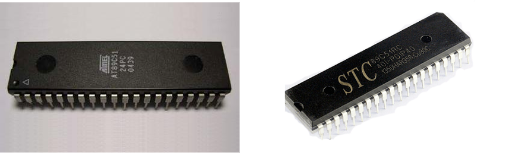

宏晶科技公司
https://baike.baidu.com/item/%E5%AE%8F%E6%99%B6%E7%A7%91%E6%8A%80?fromModule=lemma_search-box 
ATMEL公司
https://baike.baidu.com/item/ATMEL%E5%85%AC%E5%8F%B8?fromModule=lemma_search-box 

### 32单片机（32位）
```
	STM32   ST意法半导体				  GD32   兆易创新GD
```
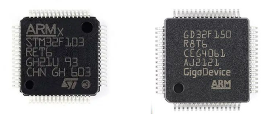

32位处理器——处理数据宽度是32位
	处理器位数——CPU单次运算最大的处理数据位数
意法半导体
https://baike.baidu.com/item/%E6%84%8F%E6%B3%95%E5%8D%8A%E5%AF%BC%E4%BD%93?fromModule=lemma_search-box 
兆易创新
https://baike.baidu.com/item/%E5%85%86%E6%98%93%E5%88%9B%E6%96%B0%E7%A7%91%E6%8A%80%E9%9B%86%E5%9B%A2%E8%82%A1%E4%BB%BD%E6%9C%89%E9%99%90%E5%85%AC%E5%8F%B8?fromModule=lemma_search-box 

## 8位和32位的区别？

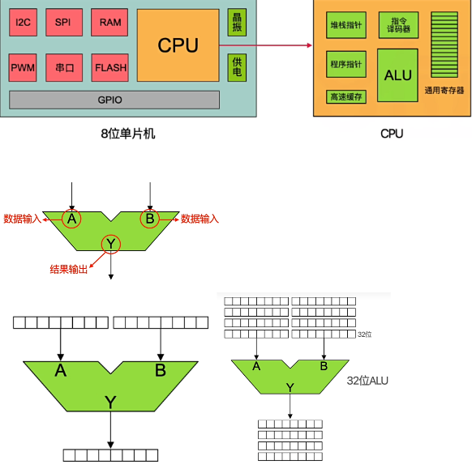

### ALU
Arithmetic and Logic Unit 算术逻辑单元
ALU有两个单元，一个算术单元，一个逻辑单元

#### 以算术单元为例：
ALU内部使用了大量的晶体管，这些晶体管合理分布使其能够实现预期功能，相应的，预期功能越大，所使用的晶体管越多。操作可能有很多，比如说加减（乘法可以使用多次加法代替）

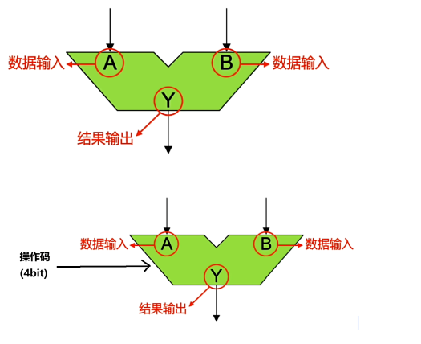

如果想要进行一个加法的运算，这个ALU是我们自己设计的，在设计的时候规定加法的操作码为 0010。如果项进行加法的运算。
A：0000 0100
B：0000 0011
CPU控制的操作码：0010
Y：结果输出

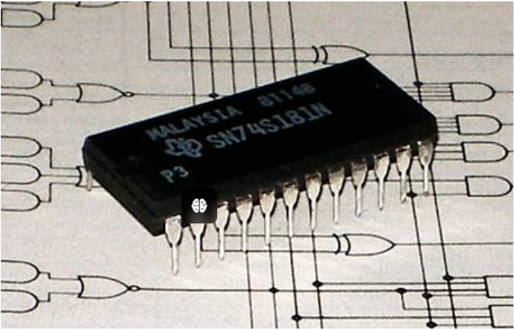

# 4.开发板介绍
开发板通常是学习用途，功能比较全，接口丰富，是用于研发、研究、学习的一块板子。
底板

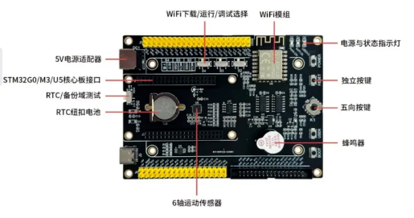

```
STM32 开发板底板，支持 5V 电源适配器与 TypeC 供电。
提供 RTC 时钟电源，提供三轴加速度与角速度传感器，用于姿态感知。
板载 ESP-12F 无线模组，用于物联网云平台项目开发。
提供 1 路五向按键，采用中断与 A/D 模式采样。
提供 1 路有源蜂鸣器，1 路 2*17P 扩展接口，用于资源扩展板的接入。
核心板接口通过 2.54mm 间距的插针引出，方便用户外接其它设备
```
## 显示屏
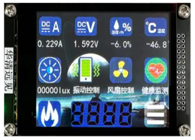

```
电容触摸显示屏在很多智能设备上得到应用，提升了设备的交互感。
在开发板套件中使用方型显示屏用来模拟圆形的一个手表项目。显示屏尺寸为 2.8寸，分辨率 320*240(RGB)。
驱动 IC采用 ILI9341，自带 172,800 字节的 GRAM 存储。电容触摸屏采用 I2C 接口，驱动 IC 采用 FT6336G。
```
## 资源拓展版
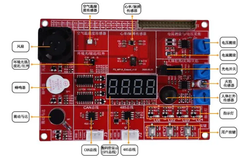
```
资源扩展板提供基于 I2C 总线的温湿度传感器、环境光感知、心率/脉搏测量。基于模数转换接口的电压/电流采集。
基于 EXTI 事件/中断控制类型的人体红外、光电开关、火焰感知传感器。
基于 SPI 总线的数码管驱动电路。
基于 PWM 控制的风扇、蜂鸣器、震动马达。
基于 GPIO 的按键、LED 指示灯。
基于异步串行通信的 485 总线电平转换。基于控制器局域网总线的 CAN 电平转换等外设。
资源扩展板主要用于微控制器入门外设的使用，硬件图纸原理以及项目案例的应用开发学习。

```
## 核心板

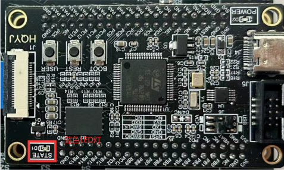

## 最小系统板
集成了核心的通用功能，可以根据需求定制各种不同的底板，通用性较好。再者核心板作为一块独立的模块被分离出来，也降低了开发的难度，增加了系统的稳定性和可维护性通常用于做项目，也可以作为模块在产品里在直接用。

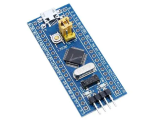

# 5.STM32基础
## 简单介绍
STM32是意法半导体公司生成的一款32位的微控制器。STM32的功能强大，性能优异，片上资源丰富，低功耗，是一款经典的微型控制器。
## 命名规范
```
 STM32F051C8T6          STM32G030C8T6          STM32U575RIT6
 ```
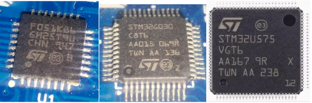

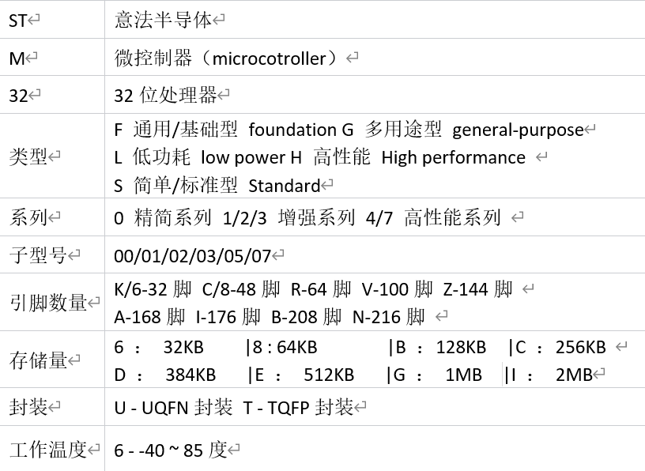

# STM32优势
https://www.stmcu.com.cn/Product/pro_detail/PRODUCTSTM32/product 

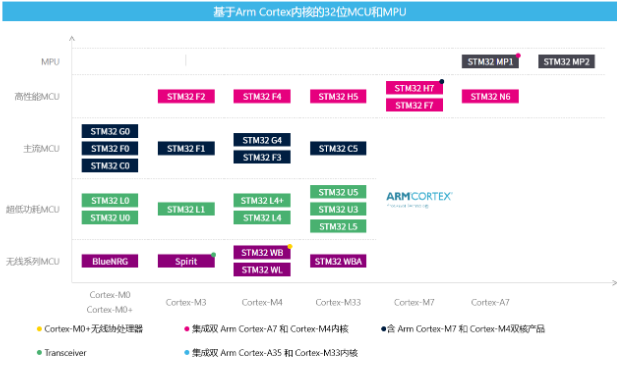

1. 产品型号丰富，可选择性强
2. 运算速度更快，功耗低
3. 处理器接口更加丰富
4. HAL库开发体系完整，可参考学习资料众多

# STM32内部架构
## STM32G0

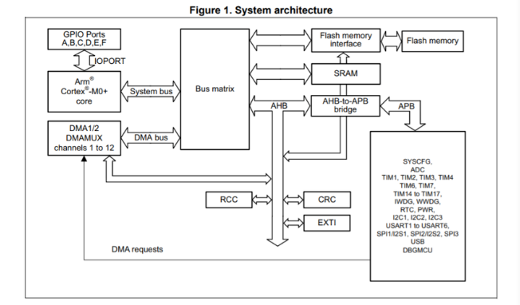

## STM32F0

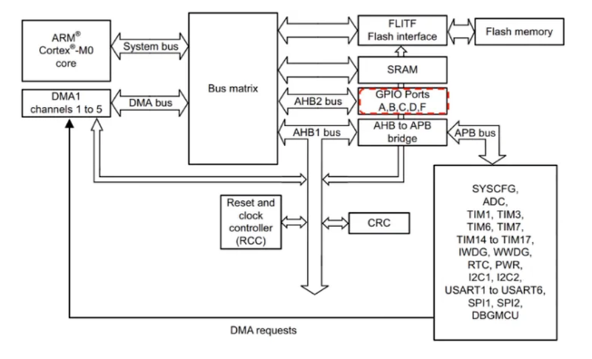

STM32U575

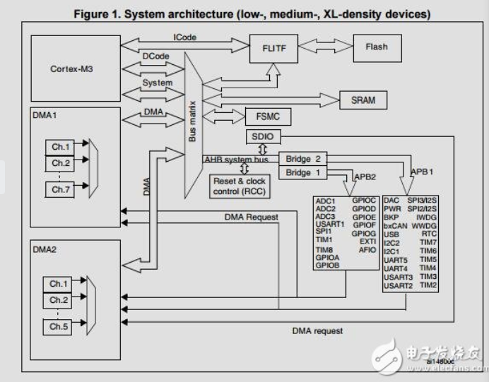

单片机的内部主要由以下几个模块构成
两个主模块：
● contex-M3内核以及高性能总线（AHB bus）
● 通用的DMA
三个从模块
● 内部的FLASH
● 内部的SRAM
● AHB和AHPB连接的APB桥上面的外设
# 6.ARM介绍
## 什么是ARM
```
1.ARM是一家公司，只做技术服务，既不生产芯片也不出售芯片。
https://baijiahao.baidu.com/s?id=1768191059704656683&wfr=spider&for=pc 
2.ARM处理器，ARM处理器是英国Acorn有限公司设计的低功耗低成本的第一款RISC的微处理器，经典处理器 ARM7\ARM9\ARM11,后续处理器（16年）开始以cortex命名。

Cortex-A:   高性能（电脑、平板、手机）
    Cortex-A5：低功耗，适合入门级应用。
    Cortex-A7：高能效，广泛应用于智能手机。
    Cortex-A9：高性能，应用广泛。
    Cortex-A15：高性能，用于更高端的设备。
    Cortex-A53：64位处理器，注重功耗与性能平衡。
    Cortex-A57：高性能64位处理器。
    Cortex-A72：用于旗舰级设备。
    Cortex-A75、Cortex-A76、Cortex-A77、Cortex-A78：不断提升的性能和能                                效，适应高端智能手机和其他高性能计算需求。
    Cortex-X1：最高性能的Cortex-A系列核心，针对旗舰设备优化
    
 Cortex-R:    汽车电子 、火箭、导弹、坦克（实时性）（对设备的实时性要求高）
    Cortex-R4：适用于高性能实时应用。
    Cortex-R5：增强的实时性能。
    Cortex-R7：更高的性能和确定性。
    Cortex-R8：最新的实时处理器，提供更高的性能和安全性。
    
 Cortex-M:    低成本、低功耗的解决法案
    Cortex-M0：超低功耗，适合简单应用。
    Cortex-M0+：进一步降低功耗并提高性能。
    Cortex-M3：平衡性能和能效，用于多种嵌入式应用。
    Cortex-M4：增加DSP功能，适用于信号处理应用。
    Cortex-M7：最高性能的Cortex-M处理器，适用于复杂的嵌入式系统。
    Cortex-M23：基于ARMv8-M架构，支持TrustZone安全特性。
    Cortex-M33：更高的性能和安全性，适用于高级嵌入式应用。
    
    cortex — X
        它们主要针对高端智能手机、平板电脑、笔记本电脑和其他需要高计算能力和                            能效的设备。这些芯片的设计目标是提供领先的单线程性能和整体系统性能。
    Cortex-X1：
        首款Cortex-X系列产品，于2020年发布。
        相较于Cortex-A77，性能提升了约30%。
        
        Cortex-X2：
        2021年发布，基于ARMv9架构。
        提供进一步的性能提升，并改进了机器学习和安全功能
3.ARM本身还是一款指令集
```
## ARM体系结构

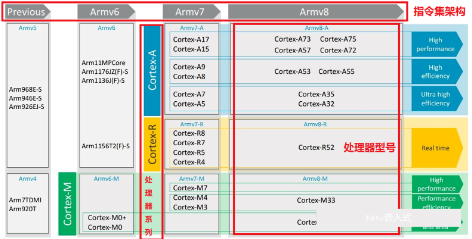

## 指令集
指令集：指令的集合
指令：能够指示处理器运行命令 + - * /
指令在程序中的作用
在程序中，指令的组合形成了一系列步骤，每个步骤执行特定的操作，从而完成整个程序的功能。通过有序地执行这些指令，处理器可以实现从简单的数学运算到复杂的逻辑控制、数据处理、设备管理等各种任务。
### 指令集的分类
#### RISC（Reduce）精简指令集
```
精简指令集(RISC)-->微处理器
只保留常用的的简单指令，硬件结构简单，复杂操作一般通过简单指令的组合实现，一般指令长度固定，且多为单周期指令。
RISC处理器在功耗、体积、价格等方面有很大优势，所以在嵌入式移动终端领域应用极为广泛
举例：如有加法运算器 ，没有乘法运算器  3*3  ---》3+3+3  

```
#### CISC（Complex）复杂指令集

```
复杂指令集(CISC)-->电脑CPU
不仅包含了常用指令，还包含了很多不常用的特殊指令，硬件结构复杂，指令条数较多，一般指令长度和周期都不固定
CISC处理器在性能上有很大优势，多用于PC及服务器等领域 

```
#### 精简指令集
优点：功耗低，便宜，体积小，指令简短，散热需求小
缺点：指令集相对复杂指令集性能更差

#### 复杂指令集
优点：运算速度更快
缺点：功耗高，成本高，指令集复杂，散热需求高
ARM是一种精简指令集
# 7.Contex-M33

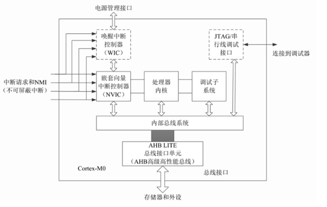

微处理器主要包含了处理器的内核，嵌套中断向量控制器（NVIC），调试子系统，内部总线系统构成，微处理器内核通过精简的AHB高性能总线接口（AHB-LITE）与外部进行通信。
## M33的特性
1.Cortex-M33是ARM推出的中高端嵌入式处理器，面向物联网（IoT）、实时控制和。安全关键应用设计，平衡性能、能效与安全性。
2.应用场景：智能家居，工业自动化，医疗设备等。
3.采用ARMV8架构，32位AHB总线，支持多主设备并发访问。
## M33的工作模式

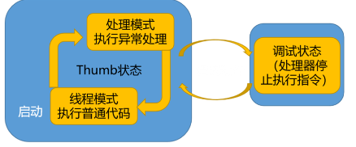

线程模式：芯片进行了复位之后，执行的用户程序
处理模式：当处理器发生了异常或者中断的时候执行，处理完中断和异常返回线程模式。
# 8.如何进行单片机的开发

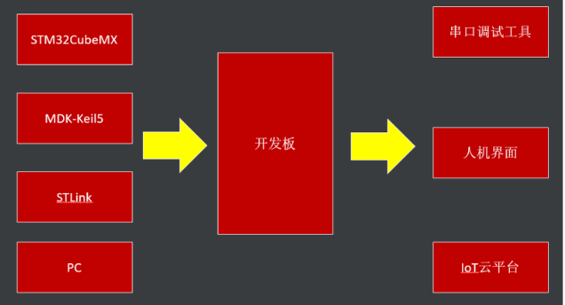

## 开发环境的搭建
STM32CubeMX
作用及功能
1.工程项目搭建和配置
2.直观地选择微控制器
3.图形化引脚功能配置，引脚冲突提示
4.动态的配置时钟树
5.动态设置参数和初始化
## keil_5
keil_5的构成
MDK包含以下几个部分:
μVision5：一种集成开发环境，提供了多种不同的功能，如编辑器、编译器、调试器等。
ARM编译器：一种嵌入式ARM C / C++编译器，可在多种不同的微控制器平台上运行。
Device Family Pack：一种特定于属于不同微控制器平台/系列/型号的软件包，包括库文件、设备描述文件等。
Debugger：一款高级调试器，支持多种不同的调试功能，如单步调试、断点调试、内存映射等。

# 9.如何点亮一盏灯

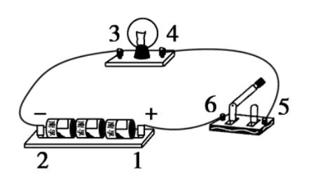

灯亮需要电流，电流的产生需要电势差
3.3V----------+灯- -------------GND（0V）
## 开发板上的LED

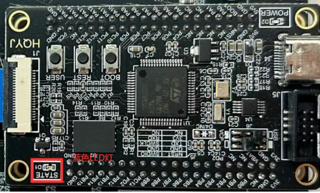

如果想要在原理图中找到相关的器件，那么我们就必须在开发板上找到相应器件的丝印，然后根据器件所在的板块在相应的原理图中查找。

## 原理图中的LED

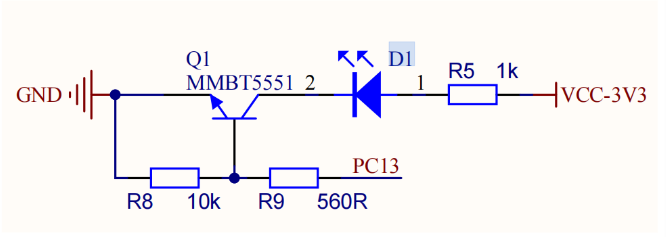

### 原理图
```
原理图（Schematic Diagram），也称为电路图或电气图，是一种图形表示方法，用于展示电子系统或电路的工作原理和组成部分之间的连接方式。它通常包括各种符号来代表电子元件（如电阻器、电容器、晶体管等）以及连线来表示它们之间的电气连接。
```
### 电路中常见的结构以及元器件
#### 二极管

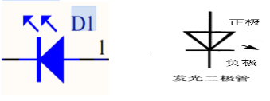

```
特点：正向导通，反向截止

记忆：将此符号看作一个箭头，顺着箭头的方向，电压降低才导通(压差最小为0.7v)，否则相当于电阻无穷大。

有一种二极管在其导通时可以发光，这种二极管叫做发光二极管(Light Emitting Diode)
发光二极管又叫LED

```
#### 三极管
三极管一般分为两种类型：PNP型三极管以及NPN型三极管
##### NPN型三极管

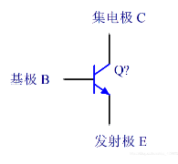

基极高于发射极
基本上三极管我们可以理解为一个开关，当基极高于发射极的时候，集电极与发射极导通，电流从集电极流向发射极。给一个`高电平导通`
##### PNP型三极管

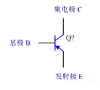

基极低于发射极
当基极低于发射极的时候，发射极和集电极导通，电流从发射级流向集电极。
低电平导通
##### 三极管在电路中的作用
三极管在电路中一般有着，数字开关，放大电路，还可以与电阻电容结合形成稳压电路或者振荡电路。
### 电路分析

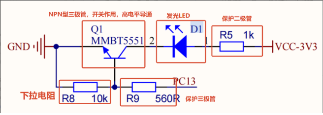

#### 上拉电阻：
VCC连接一个电阻连接到信号线
作用：在没有外界电路接入或者外界电路的电平状态不确定的情况下，让电路保持在高电平状态。

#### 下拉电阻：
GND连接一个电阻连接信号线
作用：在没有外界电路接入或者外界电路的电平状态不确定的情况下，让电路保持在低电平状态。
```
由以上的分析可知，只需要给PC13引脚一个高电平，灯即可被点亮，反之，灯灭。
```