# STM32（51-02GPIO）
# 1.GPIO概念
## 简介
GPIO全称（General purpose Input output）：通用的输入输出接口
I：input 输入
O：output 输出
GPIO是嵌入式系统，单片机开发中最常用的接口，用户可以通过编程灵活的对接口进行控制，实现对电路板上LED、数码管、按键等常用设备控制驱动，也可以作为串口的数据收发管脚，或AD的接口等复用功能使用。其作用和功能是非常重要的。
## 实际应用
input   输入-》信息或者电压的采集        各种传感器 ，按键。
output  输出-》控制外部设备              LED，马达，蜂鸣器，继电器，风扇。
## 功能描述

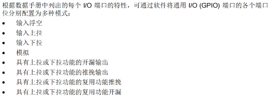

## 功能框图

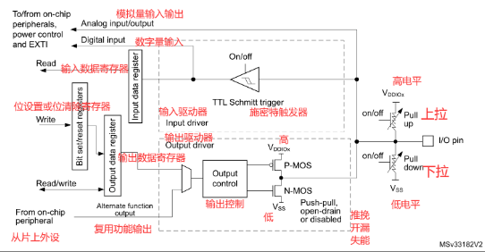

VDD：元器件内部的工作电压
VCC：接入电路的电压
VSS：公共的接地端
### TTL施密特触发器
#### 去除噪声：
由于外部输入的电信号，可能会出现脉冲等噪声的影响，为了让信号更加清晰，所以就设置了TTL施密特触发器来进行整形。
#### 波形整形：
对于上升沿和下降沿比较缓慢的输入信号，施密特触发器可以将其转换为边缘陡峭的方波信号。这对于后续的数字电路处理非常重要，因为数字电路要求输入信号具有明确的高电平和低电平。
#### 提高抗干扰能力：
由于施密特触发器具有滞回效应，它能够提高电路的抗干扰能力。即便输入信号存在一定程度的抖动或者噪声，施密特触发器仍能保持稳定的输出状态。
#### 施密特触发器的工作原理
	施密特触发器的核心就在于它的滞回效应，使得施密特触发器具有两个不同的触发电平-----上触发电平 VT+   下触发电平VT-
当输入的电压从低电平开始向高电平上升时，只有超过VT+，输出才会切换到高电平。
当输入的电压从高电平开始向低电平下降时，只有超过VT-，输出才会切换到低电平。
# GPIO的基本功能
## 浮空输入
通过寄存器的配置，让电路中的上拉电阻和下拉电阻均不接入电路

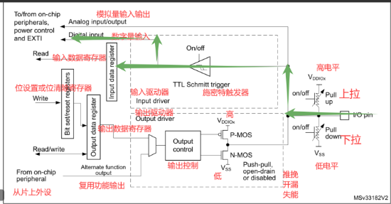

```
IO端口-》施密特触发器-》输入数据寄存器-》CPU读取

说明：浮空输入就是让引脚什么都不接，处在悬空状态
此时上拉电阻和下拉电阻的两个开关同时断开，因为没有上拉和下拉，所以当IO口没有外界电路接入的时候，此时内部电路的电平状态处于不确定的状态，这既是一个优点又是一个缺点，好处就在于完全由外界的输入来决定电平状态。

应用：一般会放在用于开关或者其他元器件内部的电平状态的读取，还用于一些比较的标准的通信协议（UASART）

```
## 上拉输入
通过寄存器的配置，让上拉电阻接入电路，在没有信号输入的情况下，IO口识别到的都是高电平。

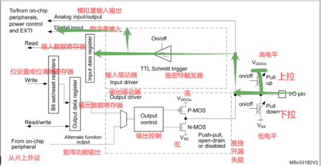

```
IO口/ 上拉电阻-》施密特触发器-》输入数据寄存器-》cpu读取

说明：当没有信号输入或者当外界电路的电平状态不确定的时候，上拉电阻会将信号拉高到高电平，此时IO口识别到的都是高电平，此时引脚始终读取到高电平信号。
如果有外界信号输入或者电平状态稳定，以外界电路的电平状态为主。

应用：输入的信号不稳定的时候。
```
## 下拉输入
通过寄存器的配置，让下拉电阻接入电路，在没有信号输入的情况下，IO口识别到的都是低电平。

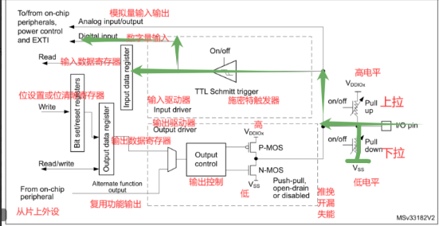

```
IO口/ 下拉电阻-》施密特触发器-》输入数据寄存器-》cpu读取

说明：当没有信号输入或者当外界电路的电平状态不确定的时候，下拉电阻会将信号拉低到低电平，此时IO口识别到的都是低电平，此时引脚始终读取到低电平信号。
如果有外界信号输入或者电平状态稳定，以外界电路的电平状态为主。
```
## 模拟输入
原汁原味的信号，什么都不经过

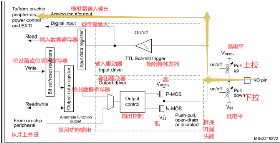

```
IO口进来-》片上外设

说明：信号进入后不经过上拉电阻或者下拉电阻，关闭施密特触发器，经由另一线路把电压信号传送到片上外设模块。 所以可以理解为模拟输入的信号是未经处理的信号，是原汁原味的信号。

应用：多用于ADC数据的采集
```

## 推挽输出
推挽：描述的是电流的动作

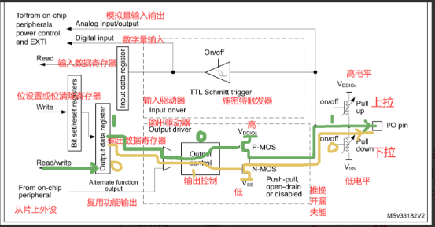

推：N-MOS管关闭，P-MOS管打开，电流从内部的VDD给外部供电，电流从内部被推出去。
挽：P-MOS管关闭，N-MOS管打开，电流从外部流向内部的VSS，此时电流被挽回来。
```
输出数据寄存器为0-》输出控制1-》激活 N—MOS——》输出低电平
输出数据寄存器为1-》输出控制0-》激活 P—MOS——》输出高电平

1.具备输出高低电平的能力。
2.推挽输出就是可以需要利用两个不同的MOS管来实现输出。
推挽输出模式下（P-MOS管+N-MOS管），通过设置位设置/清除寄存器或者输出数据寄存器的值，途经P-MOS管和N-MOS管，最终输出到I/O端口。
3.一般最常用的输出方式，既能输出高电平也能输出低电平。
```
## 开漏输出
P-MOS管不使用

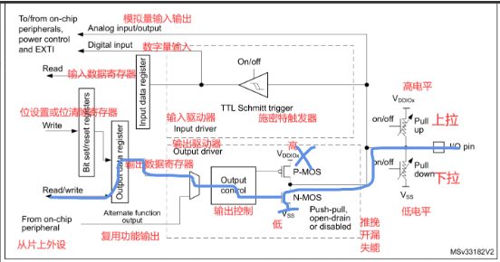

```
在开漏模式下，输出的引脚会存在两种状态
1.低电平状态（逻辑0）：当内部的晶体管（N-MOS）导通的时候，引脚的点评状态被拉低到低电平，输出低电平。
2.当晶体管（N-MOS）也关闭的时候，内部处在高阻态。没有办法输出电平，但是可以使用上拉电阻将电平状态拉高，来输出一个高电平。

虽然我们可以看到开漏输出是没有办法在内部输出一个高电平，但是这一个看似是缺点。其实实际上是一种优点。当给一个低电平的时候，MOS管没有导通，此时电压不确定导致无法输出高电平，但是一旦我们在外部增加一个上拉，那么这一个缺点就会被有效避免。并且，因为是我们自己设计一个上拉，这个上拉的电压是由我们自己确定，这样我们就可以根据外部电路需要多少V的高电平来给这一个上拉的电压，可以更好的适应更多情况。
```
推挽和开漏的区别

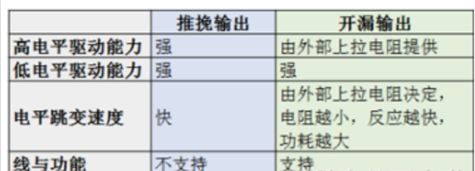

## 复用的推挽
## 复用的开漏
# GPIO相关的寄存器

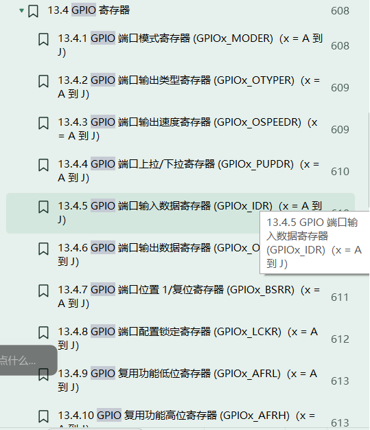

## 寄存器的定义
为什么要学习寄存器，寄存器的作用是什么？
1.寄存器是单片机内部的存储单元
2.单片机模式的设置和寄存器直接关联的，比如输出模式，输出的高低电平，上拉电阻和下拉电阻是否打开，所以，想要对单片机进行设置就是对寄存器改写的过程。

下面我们以PC13引脚输出高电平为例进行寄存器的查找以及配置
## 时钟使能寄存器
我们需要寻找内存的分布图，查看我们要使用的GPIO连接的总线是哪一条。
1. 确定GPIO连接的总线

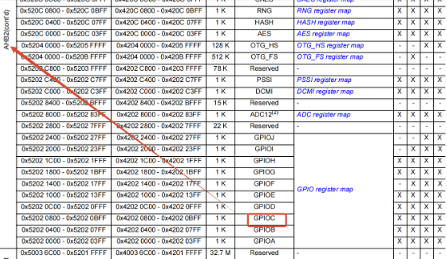
2. 找到总线相关的时钟寄存器

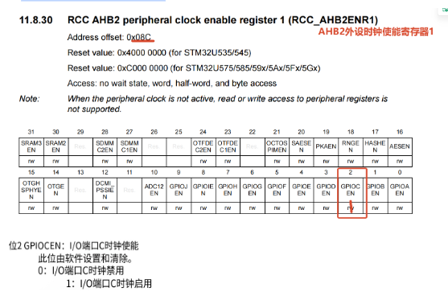

如果我们想使用GPIOC端口的话，我们就必须开启RCC_AHB2ENR的位2置为1
## 端口模式寄存器

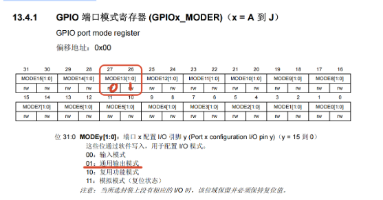

注意：此寄存器两个两个位控制一个引脚
PC13配置为输出模式：位27，和位26置为 0，1
## 端口输出类型寄存器


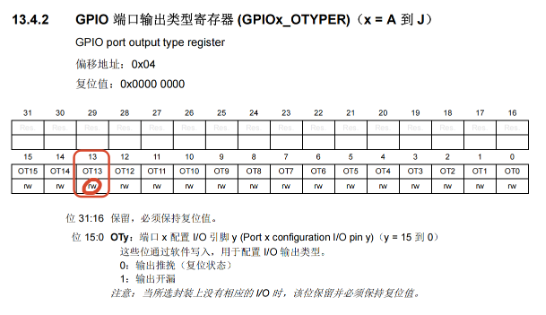

PC13引脚配置为低速输出：位27，26 分别置为 0，0
## 端口上下拉寄存器

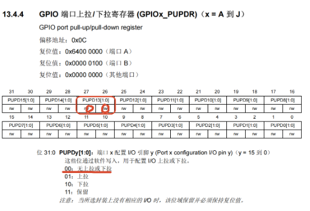

PC13引脚配置为没有上下拉：位27，26，置为0，0
## 输出数据寄存器

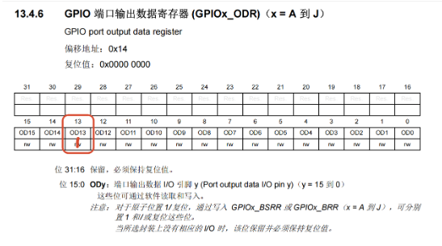

PC13配置输出高电平：位13置为1
## 总结
```
1. 打开时钟使能寄存器   RCC_AHB2ENR1 位2写1
2. 配置端口输出模式寄存器 GPIOC_MODER 位27，26置为0，1
3. 配置端接口输出类型寄存器 GPIOC_OTYPER 位13 置为 0
4. 配置端口输出速度寄存器 GPIOC_OSPEEDR 位 27，26置为0，0
5. 配置上下拉寄存器 GPIOC_PUPDR 位 27 26置为 0，0
6. 配置输出数据寄存器 GPIOC_ODR 位 13置为1

置0公式： 寄存器的地址 &= ~(1 << n)
置1公式： 寄存器的地址 |= (1 << n)
```
# 2.GPIO实验
寄存器点灯
1. 创建一个文件

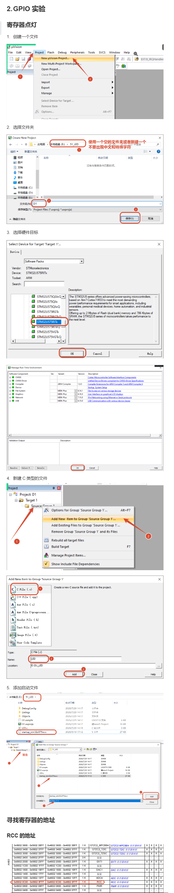

## 寻找寄存器的地址
### RCC的地址
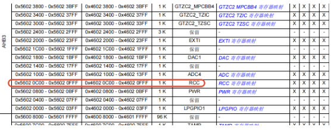
### GPIOC端口地址
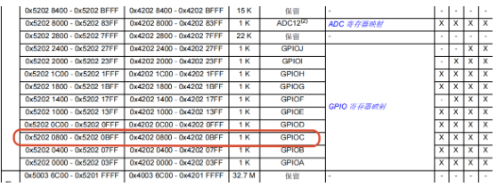

```c
1. 打开时钟使能寄存器   RCC_AHB2ENR1 位2写1
    0x56020c8c |= (1<<2);
2. 配置端口输出模式寄存器 GPIOC_MODER 位27，26置为0，1
    0x52020800 &= ~(1<<27);
    0x52020800 |= (1<<26);
3. 配置端接口输出类型寄存器 GPIOC_OTYPER 位13 置为 0
    0x52020804 &= ~(1<<13);
4. 配置端口输出速度寄存器 GPIOC_OSPEEDR 位 27，26置为0，0
    0x52020808 &= ~(1<<27);
    0x52020808 &= ~(1<<26);
5. 配置上下拉寄存器 GPIOC_PUPDR 位 27 26置为 0，0
    0x5202080C &= ~(1<<27);
    0x5202080C &= ~(1<<26);
6. 配置输出数据寄存器 GPIOC_ODR 位 13置为1
    0x52020814 |= (1<<13);
```
## 代码编写

```c
void SystemInit(void)
{
	*(unsigned int*) 0xE000ED88|=((3UL << 20U)|(3UL << 22U));
}
int main(void)
{
		//1. 打开时钟使能寄存器   RCC_AHB2ENR1 位2写1
				*(unsigned int *)0x56020c8c |= (1<<2);
		//2. 配置端口输出模式寄存器 GPIOC_MODER 位27，26置为0，1
				*(unsigned int *)0x52020800 &= ~(1<<27);
				*(unsigned int *)0x52020800 |= (1<<26);
		//3. 配置端接口输出类型寄存器 GPIOC_OTYPER 位13 置为 0
				*(unsigned int *)0x52020804 &= ~(1<<13);
		//4. 配置端口输出速度寄存器 GPIOC_OSPEEDR 位 27，26置为0，0
				*(unsigned int *)0x52020808 &= ~(3<<26);
		//5. 配置上下拉寄存器 GPIOC_PUPDR 位 27 26置为 0，0
				*(unsigned int *)0x5202080c &= ~(3<<26);
		//6. 配置输出数据寄存器 GPIOC_ODR 位 13置为1
				*(unsigned int *)0X52020814 |= (1<<13);
}

```

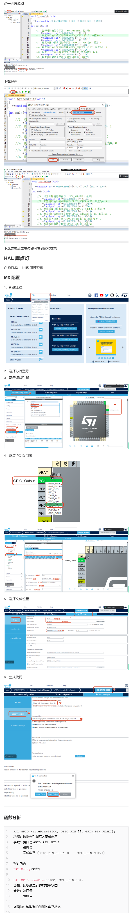

# 函数分析
```c
HAL_GPIO_WritePin(GPIOC, GPIO_PIN_13, GPIO_PIN_RESET);
功能：给指定引脚写入高低电平
参数：端口号GPIO_PIN_SET:1
      引脚号
      高低电平（GPIO_PIN_RESET:0     GPIO_PIN_SET:1）
      
延时函数
HAL_Delay(毫秒)

HAL_GPIO_ReadPin(GPIOC, GPIO_PIN_13);
功能：读取指定引脚的电平状态
参数：端口号   
      引脚号
      
返回值：读取到的引脚的电平状态

HAL_GPIO_TogglePin(GPIOC, GPIO_PIN_13);
功能：翻转指定引脚的电平状态
参数：端口号   
      引脚号
返回值：不关心

```

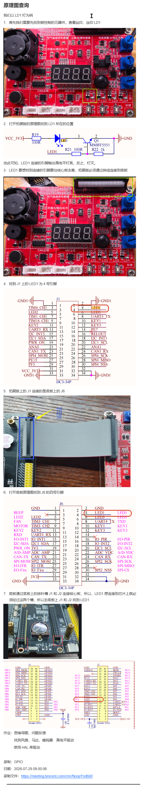


tim4 ch1  3x			31 30
tim1 ch1  7  fan        12 13
tim16 ch1  9  motor     14 15
