STM32（51-03USART）
1.串口通信
什么是串口？
是一种可以将接收来自CPU的并行数据字符转换为连续的串行数据流发送出去，同时可将接收的串行数据流转换为并行的数据字符供给CPU的器件。一般完成这种功能的电路，我们称为串行接口电路或串行通信接口电路。
什么是通信？
1.至少有两个端，发送端，接收端。
2.信息的传递
3.数据的交互
电平信号和差分信号
1.电平信号
电平信号通过单一信号线的电压高低表示逻辑状态，高电平（通常为+5V、+3.3V或更高）代表逻辑“1”，低电平（通常为0V或接近0V）代表逻辑“0”。
2.差分信号
差分信号通过两根信号线（如V+和V-）的电压差值传递信息，逻辑状态由差值正负决定
2.通信的划分
根据通信的方式划分
串行通信
串行通信：指的是同一时刻只能接收或者发送1Bit的信息，因此只需要使用一根信号线即可
串行传输：数据一位一位的串起来，逐个按位进行传输。

优点：节省引脚资源
缺点：传输速度慢
并行通信
并行通信：指的是同一时刻可以传输一个数据的多个位，因此需要多根信号线。
并行传输：使用多根数据线一次传输一个数据的多个位，同时进行传输。

优点：传输速度快
缺点：占用引脚资源多
根据通信的方向划分
1.单工通信：要么接收，要么发送，只能作为接收设备或者发送设备  广播
一根单向的数据线
2.半双工：即可以接收也可以发送，但是不能同时进行          对讲机
一根双向的数据线
3.全双工：可以在同一时刻发送或者接收         手机
至少两根数据线
根据时钟信号进行划分
同步通信：通信双方根据同步信号通信，比如双方有一个共同的时钟信号(SPI全双工 I2C半双工)
发送数据的时候会出现阻塞状态，需要等待数据传输完毕，程序才会执行到下一行

       异步通信：通信双方有自己独立的系统时钟，大家约定好通信的速度。异步通信不需要同步信号，但是并不是说通信的过程不同步（UART）
发送数据的时候没有阻塞状态，执行发送数据语句后直接执行下一行语句

通信速率
通信速度：单位时间内接受或者发送的数据的位数
波特率：每秒钟发送的位数
单位：  bit/s     bps
常见的波特率：9600bps    115200bps
常见的通信协议

3.USART和UART
简单介绍
USART 能够灵活地与外部设备进行全双工数据交换，满足外部设备对工业标准 NRZ 异步串行数据格式的要求。USART 通过小数波特率发生器实现了多种波特率。（可配置的波特率） 
USART 不仅支持同步单向通信和半双工单线通信，以及 LIN（局域互连网络）、智能卡协 议、IrDA（红外线数据协会）SIR ENDEC 规范和调制解调器操作 (CTS/RTS)，还支持多处 
理器通信。
●USART：支持同步通信或者异步通信，全双工，串行
●UART：没有时钟线，只支持异步通信，全双工，串行
●实际上USART和UART是一种包含的关系，当USART选择放弃时钟线的时候就是UART
通信结构
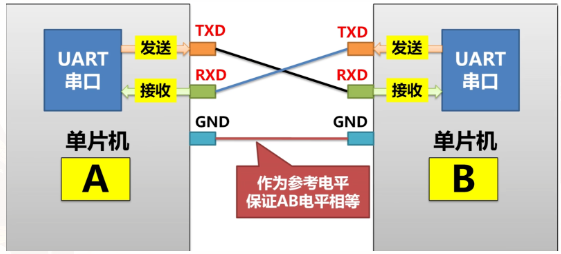

功能框图

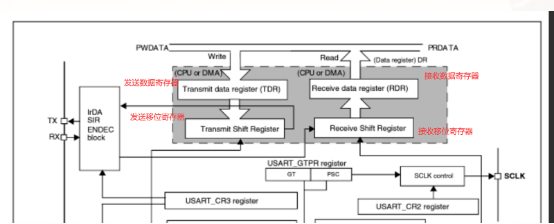
发送的过程
由CPU或者DMA往TDR中写入数据
然后由硬件自动检测发送移位寄存器中是否有数据正在移位，如果此时有数据正在移位，则数据等待当前移位寄存器移位完成后再往移位寄存器中放，此过程也是硬件执行。当TDR中的数据放到移位寄存器中的那一刻，TDR空，这时候中断状态寄存器的TXE置1，它来表示发送数据寄存器空。
如果此时没有数据正在移位，则直接由硬件将TDR中的数据放到发送移位寄存器中。
需要注意的是当TDR中的数据在等待往移位寄存器中放的时候，如果此时CPU或者DMA继续向TDR中写入数据，会将TDR中的数据覆盖掉。
接收的过程
首先数据线通过RX口连到接收移位寄存器
接收移位寄存器对线上的电平进行读取，将读取到的数据放到最高位，读下一位数据时，先把已有的位整体往右移一位，然后再将读到的数据放到最高位，以此往复，直到读满8位。
读满八位以后整体往RDR中放，此时RDR非空，中断状态寄存器标志位RXNE置1，它来表示RDR非空。

串口通信协议
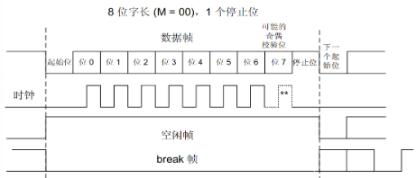
数据帧格式的组成
1.空闲状态：信号线保持在高电平（高电平的抗干扰能力更强）
2.起始位：1bit，低电平表示通信的开始
3.数据位：7、8、9位可选择
4.检验位：（可配置，可忽略）：如果不设置校验位，此处充当普通的数据位
        奇校验：数据位上1的个数+校验位上1的个数 = 奇数
			偶校验：数据位上1的个数+校验位上1的个数 = 偶数
 注意：校验位的设置仅仅只能发现传输过程中的错误，但是不能修改
5.停止位：将信号线拉回高电平的状态（可配置）。
逻辑电平标准
TTL
TTL电平：逻辑1：2.4V-5V     逻辑0： 0-0.5V
TTL电平下的串口通信协议
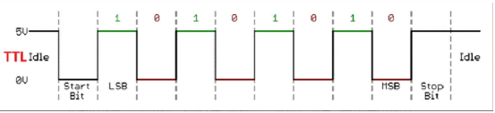
RS-232
电平标准： +3  ~  +15V：代表逻辑0
           -3  ~  -15V：代表逻辑1
RS-232电平下的串口通信协议
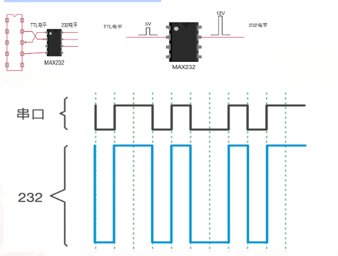
RS232的抗干扰能力更强
RS-485
RS-485仅是一个电气标准，描述了接口的物理层，像协议、时序、串行或并行数据以及链路全部由设计者或更高层协议定义。 RS-485定义的是使用平衡多点传输线的驱动器和接收器的电气特性。
RS-485能够进行远距离传输主要得益于使用差分信号进行传输，当有噪声干扰时仍可以使用线路上两者差值进行判断，使传输数据不受噪声干扰。
半双工、是电气协议（逻辑1：+2V–+6V            逻辑0： -6V— -2V）是二线制差分信号，也就是实际传输的数据是通过判断这两条信号线上的电压差来实现的，RS-485总线弥补了RS-232通信距离短，速率低的缺点，RS-485的速率可高达10Mbit/s，理论通讯距离可达1200米；RS-485和RS-232的单端传输不一样，是差分传输，使用一对双绞线
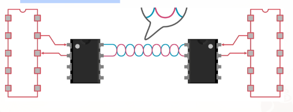
串口相关寄存器
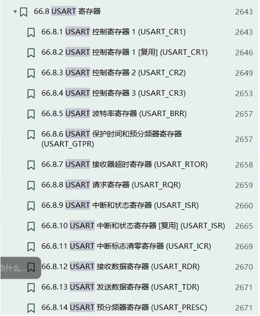
串口控制寄存器
	USART_CR
	USART_CR1
USART_CR2
USART_CR3
决定数据帧的格式：（设备功能初始化、通信帧格式配置）
波特率寄存器
USART_BRR		决定通信速度： bps  bit/s
数据发送寄存器  
USART_TDR		决定发送的数据：将要发送的数据写入
数据接收寄存器 
USART_RDR      决定接收的数据：将要接收数据的读取
中断和状态寄存器 
USART_ISR
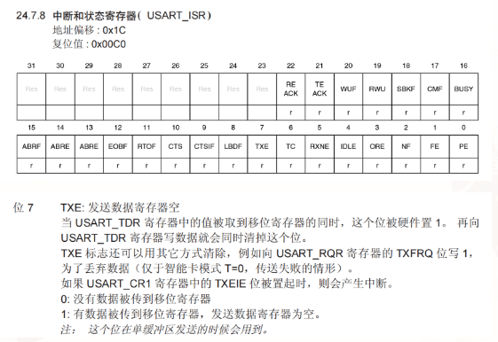
4.串口实验
串口发送实验
分析原理图
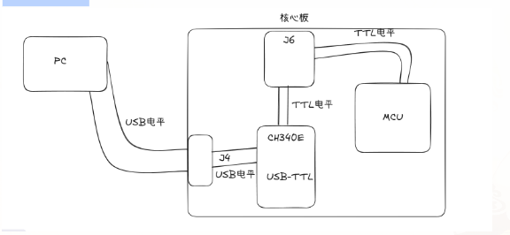
连接发送和接收的两个引脚为PA9和PA10
MX配置
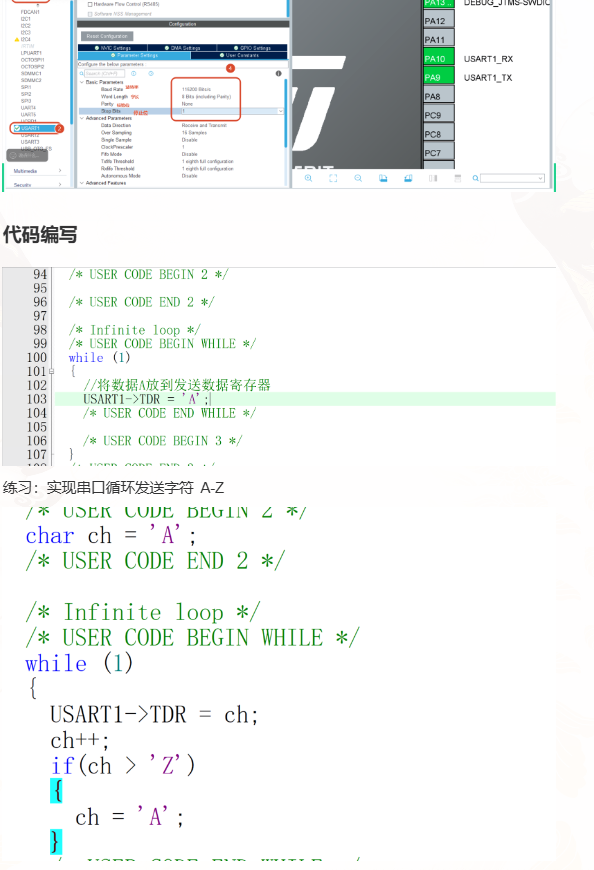
如果不加延时会出现乱序，因为往TDR中放入数据的时候速度过快，导致TDR中的值被覆盖
解决办法：
如果不加延时如何解决？
在CPU向TDR写入数据之前，先判断ISR位7，TXE是否为1
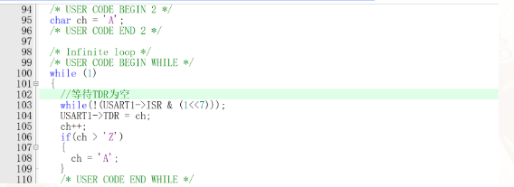
HAL库函数进行发送
函数分析
HAL_USART_Transmit (USART_HandleTypeDef * husart, const uint8_t * pTxData, 
uint16_t Size, uint32_t Timeout)
功能：以阻塞的形式发送大量的数据
参数：句柄
      要发送的数据
      要发送的数据的大小
      timeout超时检测
返回值：不关心
代码分析
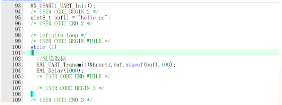

作业
1.思维导图，问题反馈
2.使用按键控制蜂鸣器，马达，风扇，LED，每按一下控制一个器件
选做（使用串口发送，这几个执行的状态）
会放链接
录制：USART
日期：2026-07-30 09:01:11
录制文件：https://meeting.tencent.com/crm/NAYqGBBE2c
