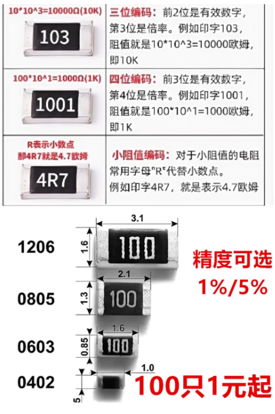
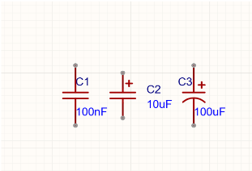
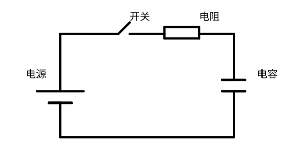

# 基本元器件
# 1.1 电阻
## 1.1.1 作用
电阻的工作原理是基于欧姆定律，即电阻的阻值取决于其材料、长度和横截面积。电阻的主要作用是限制电流，调节电压和电流，以及保护电路。
## 1.1.2. 数值计算

## 1.1.3. 电阻的分类
### 1.1.3.1. 贴片电阻

## 1.2. 电容

电容的单位是伐啦，简称法，符号F，常用单位毫法(mF)、微法、纳法、皮法
### 1.2.0. 电容的作用和特性
电容具有电压不突变的特性，可以利用这点实现滤波；阻碍电压变化，通交隔直。
### 1.2.1. 原理

