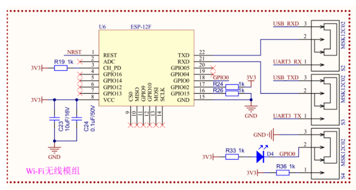
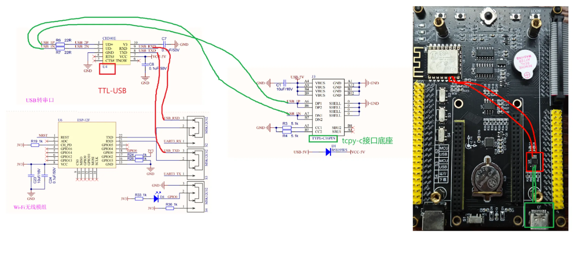
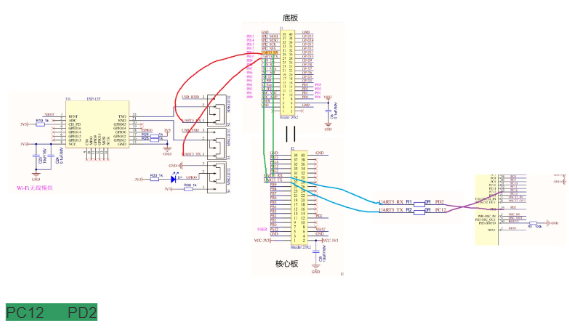
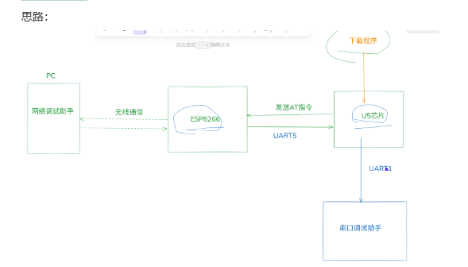
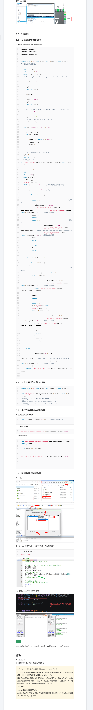

# 大纲 
WIFI：ESP8266 的使用（AT指令）                                                              知识较为整体
FreeRTOS：实时操作系统 任务（Linux 进程 线程），
创建 调度 状态切换 同步 互斥（互斥锁 信号量 队列 事件组）软件定时器                    知识较为零碎
LVGL：嵌入式图形库 组件（控件）
# 1.认识WIFI：
安信可ESP8266系列模组：
https://docs.ai-thinker.com/esp8266     

UART-WiFi->串口加WIFI
pc与u5之间的通信是用线通信的，这个叫有线通信
而pc-esp8266-u5是无线的，是无线通信（其中pc-esp8266是无线通信，esp8266-u5是用串口通信）
这个esp8266是2.4G的，他是把数据给到路由器然后路由器进行云端通信，然后手机的SIM卡是可以进行3/4/5G通信
# 1.3 固件
固件就是程序，是用户不能修改的代码，是用户可以靠发送指令控制芯片的代码。固件也可以自己烧（更新）。
# 2.原理图：

18 21 22号
18号：S4 控制wifi模式：
        GPIO0低电平--下载模式 下载固件
        GPIO0高电平--运行模式 通信
21号：WIFI接收 22号：WIFI发送   ---USB端--PC端  UART端
# 3.PC端配置WIFI：

# 4.AT指令：
终止符要求：每条指令必须以 \r\n 结尾
## 4.1 检测：AT
AT
## 4.2 复位：AT+RST
AT+RST
## WIFI模式的设置：AT+CWMODE = 
0：无Wi-Fi模式，并且关闭Wi-Fi RF  一般设置不成功
1：Station模式----------可以连接其他热点√√
2：SoftAP模式-----------变成一个路由器，可以发射wifi信号成为一个热点  别人连接我（只能往外发射网，自身不能联网）
3：SoftAP+Station模式---混合模式√（又能联网又能发射网）
## 4.4 连接热点：AT+CWJAP
连哪个网，名称密码是什么
语法：AT+CWJAP="热点名称","热点密码"
## 4.5 连接TCP服务器
语法：AT+CIPSTART="TCP","IP地址",端口号
错误码：
回复错误码1：连接超时 
回复错误码2：密码错误
回复错误码3：找不到该AP(热点)
回复错误码4：连接失败 
## 4.5 连接TCP服务器
语法： AT+CIPSTART = "TCP","IP地址"，端口号
## 4.6 数据发送：AT+CIPSEND=5
AT+CIPSEND=发送的字符的数量
发送的字符（必须完全符合数量）
## 4.7.2 如何设置透传模式
设置透传模式的指令：AT+CIPMODE=1
                  AT+CIPMODE=0(取消透传指令)
使用透传模式：AT+CIPSEND
退出透传模式：单独数据包+++
# 单片机控制ESP8266

## 前期准备工作：
1.串口线插到核心板上
2.S2  S3拨码开关拨动到MCU端  s4 在运行模式
3.配置引脚
## 配置CubeMX
