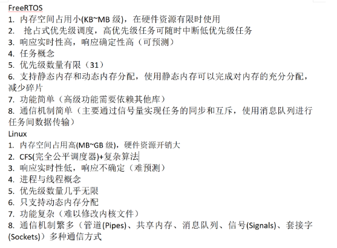
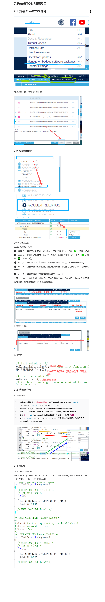

# FreeRTOS
# 什么是RTOS
实时操作系统（Real-time operating system, RTOS），又称即时操作系统，它会按照排序运行、管理系统资源，并为开发应用程序提供一致的基础。
实时操作系统与一般的操作系统相比，最大的特色就是“实时性”，如果有一个任务需要执行，实时操作系统会马上（在较短时间内）执行该任务，不会有较长的延时。这种特性保证了各个任务的及时执行。
# 问题
1.介绍RTOS
2.裸机开发与RTOS开发的区别
3.RTOS与Linux的区别
4.FreeRTOS介绍
5.FreeRTOS的机制
6.用RTOS做过什么
# 1.操作系统与裸机开发
裸机开发主打一个单线程，多任务开发 --》线程pthread_create();
传统的裸机，只有一个任务，无法处理多个任务，一次只能处理一个任务。如果在执行一个任务时，想去触发其他任务，只有一个方式，就是使用中断。

操作系统：IOS，windows，安卓，鸿蒙os，linux
支持多任务管理，并发执行，实现更复杂的裸机。提高资源利用率和系统性能。

# 2.裸机开发 vs 操作系统开发（对比）

■ 任务模型
    裸机 → 单线程：一个 main 主循环 + 中断
    RTOS → 多任务：每个任务独立执行，由调度器统一管理

■ 任务调度
    裸机 → 无调度器，靠轮询 + 中断打断
    RTOS → 调度器按优先级 / 时间片抢占调度

■ 并发能力
    裸机 → 单任务，一次只能干一件事
    RTOS → 多任务"并发"执行（宏观并行、微观快速切换）

■ 上下文切换
    裸机 → 基本没有，仅中断时做现场保护
    RTOS → 有，任务切换需保存/恢复现场（带来开销）

■ 实时性
    裸机 → 由开发者自己保证，任务一多就难保证
    RTOS → 调度器按优先级保证高优先级任务及时响应

■ 资源管理
    裸机 → 手工管理，多用全局变量 / 静态分配
    RTOS → 系统提供队列、信号量、互斥锁等同步机制

■ 中断处理
    裸机 → 在中断服务函数(ISR)里直接干活
    RTOS → ISR 尽量短，通过信号量/队列通知任务处理

■ 内存管理
    裸机 → 以静态分配为主，占用可预测
    RTOS → 常带动态内存管理(heap)，需防范内存碎片

■ 代码结构
    裸机 → 简单直接，逻辑集中
    RTOS → 模块化、任务化，抽象层次更高

■ 系统开销
    裸机 → 小，占用 RAM / Flash 少
    RTOS → 有内核开销，占用更多 RAM / Flash

■ 调试难度
    裸机 → 简单，单线程好跟踪
    RTOS → 复杂，多任务竞争、死锁、优先级翻转难排查

■ 适用场景
    裸机 → 功能简单、资源紧张（8位/小容量 MCU）
    RTOS → 功能复杂、多任务、需要实时响应的系统

一句话总结：裸机是"一个人从头忙到尾"，RTOS 是"请了个管家(调度器)帮你排班、分工、协调"，代价是多花一点 RAM/Flash 和 CPU 开销。

# 3.FreeETOS与Linux


# 5.多任务
 任务是一个逻辑概念，是为实现某个目的而进行的一系列的操作，是操作系统(RTOS)中的基本组成单元，它们为嵌入式系统提供了并发处理，实时性，模块化和资源管理等重要功能，通过任务、操作系统可以更好地管理系统资源和满足各种应用程序的需求。

● 任务的概念怎么去理解----linux中进程和线程概念的结合体，任务之间可以通过全局变量通信，每个任务都会被分配到一个栈空间来存储任务运行过程中产生的数据，多个任务同时对一个资源进行访问，会造成临界资源访问的问题，使用互斥锁、信号量PV操作。任务之间也可以通过队列进行通信。
● 优先级问题，优先级高的任务先执行，优先级低的任务后执行，优先级相同的任务抢时间片，如果发生中断，则先执行中断程序。
● 同优先级任务之间是如何实现并行呢？其实单核处理器一次只能执行一项任务，当有多个同优先级的任务时其实是通过"时间片"的方式进行调用的，不同任务间不停的快速切换就好像多个任务在同时执行一样。下图展示了与时间相关的 3 个任务的执行模式。任务名称采用颜色编码，并写在左手边。时间从左向右移动，彩色线条显示了在任何特定时间正在执行的任务。上方展示了所感知的并发执行模式，下方展示了实际的多任务执行模式。


相对于单任务系统而言，多任务系统的任务是具有优先级的，高优先级的任务可以抢占低优先级任务的 CPU 使用权。优先级相同的任务则各自轮流运行一段极短的时间（时间片），从而产生“同时”运行的错觉，这也是抢占式调度和时间片调度的基本原理。在具备优先级的多任务系统中，用户就可以将紧急的事务放在优先级高的任务中进行处理。
# 6.调度原理
调度器是内核中负责决定在任何特定时间应执行哪些任务的部分。内核可以在任务生命周期内多次挂起并且稍后恢复一个任务。
调度策略是调度器用来决定在任何时间点执行哪个任务的算法。非实时多用户系统的策略极有可能使每个任务具有"公平"比例的处理时间。
FreeRTOS 共支持三种任务调度方式，分别为抢占式调度、时间片调度和协程式调度。需要注意的是，FreeRTOS 官方对协程式调度做了特殊说明，协程式调度用于一些资源非常少的设备上，但是现在已经很少用到。虽然协程式调度的相关代码还没有被删除，FreeRTOS 官方并未计划继续开发协程式调度。我们主要理解抢占式调度与时间片调度的概念。
## 6.1抢占式调度
抢占式调度主要时针对优先级不同的任务，每个任务都有一个优先级，优先级高的任务可以抢占优先级低的任务，只有当优先级高的任务发生阻塞或者被挂起，低优先级的任务才可以运行。
## 6.2.时间片调度
时间片调度主要针对优先级相同的任务，当多个任务的优先级相同时， 任务调度器会在1ms时候切换任务，也就是说 CPU 轮流运行优先级相同的任务，每个任务运行的时间就是1ms。
一个节拍的时间也就是一个时间片的时间，当然这个节拍是由FreeRTOS滴答来规定的
## 6.3.FreeRTOS滴答
●系统节拍器：是大多数嵌入式操作系统（包括 FreeRTOS）中用于提供时间基准的硬件定时器。它以固定的频率产生中断，这个中断间隔就被称为一个 “滴答”。
●例如：如果将系统节拍定时器配置为每 1 毫秒产生一次中断，那么每 1 毫秒就是一个滴答。
时间片的长短就是 1 个滴答，而滴答中断的长短由内部的宏定义configTICK_RATE_HZ规定，一般为 1000HZ

## 6.4 任务的状态

在 FreeRTOS 中的任务存在四种状态，分别为运行态、就绪态、阻塞态和挂起态。在 FreeRTOS 运行时，任务的状态一定是这四种状态中的一种，下面是四种任务状态的介绍。
◆ 运行态
如果一个任务得到 CPU 的使用权，即任务被实际执行时，那么这个任务处于运行态。如果运行FreeRTOS的 MCU 只有一个处理器核心，那么在任务时刻，都只能有一个任务处理运行态。
◆ 就绪态
如果一个任务已经能够被执行（不处于阻塞态后挂起态），但当前还未被执行（具有相同优先级或更高优先级的任务正持有 CPU 使用权），那么这个任务就处于就绪态。
◆ 阻塞态
如果一个任务因延时一段时间或等待外部事件发生，那么这个任务就处理阻塞态。例如任务调用了函数 vTaskDelay()，进行一段时间的延时，那么在延时超时之前，这个任务就处理阻塞态。任务也可以处于阻塞态以等待队列、信号量、事件组、通知或信号量等外部事件。通常情况下，处于阻塞态的任务都有一个阻塞的超时时间，在任务阻塞达到或超过这个超时时间后，即使任务等待的外部事件还没有发生，任务的阻塞态也会被解除。要注意的是，处于阻塞态的任务是无法被运行的。
◆ 挂起态
任务一般通过函数 vTaskSuspend()和函数 vTaskResums()进入和退出挂起态与阻塞态一样，处于挂起态的任务也无法被运行。

# 6.调度原理总结（通俗版）

调度器就一个职责：决定"现在轮到哪个任务跑 CPU"。它可以在任务运行期间反复把任务挂起（暂停）再恢复（继续）。

■ 抢占式调度 —— 管"优先级不同的任务"
  ● 每个任务都有优先级，高的先跑。
  ● 高优先级任务只要就绪，立刻抢走 CPU，把低优先级任务挤下去。
  ● 只有高优先级任务阻塞（等信号量、延时等）或被挂起时，低优先级任务才有机会跑。
  ● 类比：急诊病人随时插队，普通病人只能等急诊空了才能看上。

■ 时间片调度 —— 管"优先级相同的任务"
  ● 优先级一样时，CPU 轮流给它们跑。
  ● 每个任务每次只跑一个时间片（1ms），时间一到就换下一个。
  ● 类比：几个同学轮流用一台电脑，每人用 1 分钟，到点换人。

■ 滴答（系统节拍）—— 给时间片提供"时间单位"
  ● 滴答 = 系统的心跳，由一个硬件定时器按固定频率产生中断。
  ● 每滴答一次 = 一个时间片的时间。
  ● 频率由宏 configTICK_RATE_HZ 决定，一般 1000Hz = 每秒 1000 次 = 每 1ms 滴答一次。
  ● 类比：乐队的节拍器，滴答一下就是一小节。

■ 三者的关系（一句话串起来）
  滴答（提供时间单位）→ 时间片（同优先级轮流跑）→ 抢占式（不同优先级高者先跑）

<< 嵌入式拓展 >>
  滴答中断的本质是 Cortex-M 内核自带的 SysTick（24 位倒计时定时器），多数 RTOS 都靠它做时间基准。configTICK_RATE_HZ 不是越大越好：频率越高，中断越频繁，中断开销和 CPU 被"打扰"的次数就越多，1000Hz 是常见折中。

<< AI视野 >>
  时间片轮转 = 分时复用同一块计算资源，和多个 AI 训练任务轮流占用同一张 GPU 是同一个思路；抢占式调度的"优先级"则对应实时系统里"刹车指令必须高于播放音乐"这种硬性要求。

## 6.4 任务的状态

在 FreeRTOS 中的任务存在四种状态，分别为运行态、就绪态、阻塞态和挂起态。在 FreeRTOS 运行时，任务的状态一定是这四种状态中的一种，下面是四种任务状态的介绍。
◆ 运行态
如果一个任务得到 CPU 的使用权，即任务被实际执行时，那么这个任务处于运行态。如果运行FreeRTOS的 MCU 只有一个处理器核心，那么在任务时刻，都只能有一个任务处理运行态。
◆ 就绪态
如果一个任务已经能够被执行（不处于阻塞态后挂起态），但当前还未被执行（具有相同优先级或更高优先级的任务正持有 CPU 使用权），那么这个任务就处于就绪态。
◆ 阻塞态
如果一个任务因延时一段时间或等待外部事件发生，那么这个任务就处理阻塞态。例如任务调用了函数 vTaskDelay()，进行一段时间的延时，那么在延时超时之前，这个任务就处理阻塞态。任务也可以处于阻塞态以等待队列、信号量、事件组、通知或信号量等外部事件。通常情况下，处于阻塞态的任务都有一个阻塞的超时时间，在任务阻塞达到或超过这个超时时间后，即使任务等待的外部事件还没有发生，任务的阻塞态也会被解除。要注意的是，处于阻塞态的任务是无法被运行的。
◆ 挂起态
任务一般通过函数 vTaskSuspend()和函数 vTaskResums()进入和退出挂起态与阻塞态一样，处于挂起态的任务也无法被运行。
# 7.FreeRTOS创建项目
## 


## 7.3 创建任务 
### 1.函数说明
```c
osThreadId_t osThreadNew (osThreadFunc_t func, void *argument, const osThreadAttr_t *attr)
osThreadId_t 为返回值，其实就是在操作该任务时候的句柄
参数 1：osThreadFunc_t func 这是任务函数，类似于线程函数
参数 2：void *argument 给任务函数传的参数，不传填 NULL
参数 3：const osThreadAttr_t *attr 任务相关的属性值，包括任务名字、优先级、栈空间大小等
```
## 7.5 挂起与释放任务
```c
void vTaskSuspend( osThreadId_t xTaskToSuspend );
功能：挂起任务
参数：xTaskToSuspend	要挂起的任务句柄。若传递 NULL，表示挂起当前正在执行的任务自身。
void vTaskResume( osThreadId_t xTaskToResume );
功能：恢复任务
参数：xTaskToResume	要恢复的任务句柄。必须是此前通过 vTaskSuspend() 挂起的任务

```
```c
void Task01(void *argument)
{
  /* USER CODE BEGIN Task01 */
  /* Infinite loop */
  for(;;)
  {
		a++;
		if(a==1)
			vTaskSuspend(Task02Handle);
		else if(a==10)
			vTaskResume(Task02Handle);
    osDelay(1000);
  }
  /* USER CODE END Task01 */
}

/* USER CODE BEGIN Header_Task02 */
/**
* @brief Function implementing the Task02 thread.
* @param argument: Not used
* @retval None
*/
/* USER CODE END Header_Task02 */
void Task02(void *argument)
{
  /* USER CODE BEGIN Task02 */
  /* Infinite loop */
  for(;;)
  {
    b++;
    osDelay(1000);
  }
  /* USER CODE END Task02 */
}

```
## 7.6 任务删除

```c
osStatus_t osThreadTerminate(osThreadId_t thread_id);
参数：任务的句柄

```

## 7.7 空闲任务与(空闲)钩子函数
### 7.7.1 空闲任务
创建的任务大部分时间都处于阻塞态。当所有的任务都处于阻塞态时，这种状态下所有的任务都不可运行，所以也不能被调度器选中。但处理器总是需要代码来执行——所以至少要有一个任务处于运行态。为了保证这一点，当调用 vTaskStartScheduler()时，调度器会自动创建一个空闲任务。空闲任务拥有最低优先级(优先级 0)以保证其不会妨碍具有更高优先级的应用任务进入运行态。运行在最低优先级可以保证一旦有更高优先级的任务进入就绪态，空闲任务就会立即切出运行态。
空闲任务的核心作用是在无其他任务运行时维持系统基本运作，在 CPU 闲置时默默执行资源维护（清理内存）、节能调度（触发休眠，防止 CPU 空转），并通过（空闲）钩子函数提供灵活扩展能力
空闲任务由系统的调度器在启动时自动创建和管理的，那调度器在哪里呢
调度器说到底也是一堆代码实现的，具体位置在主函数的 osKernelStart 函数
