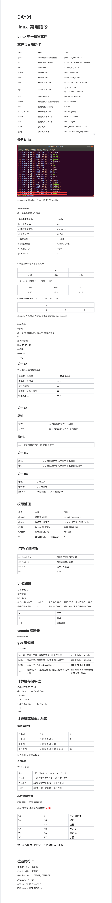

# linux 常用指令
Linux中一切皆文件
## 文件与目录操作
```
命令	作用	                示例
pwd		显示当前文件所在位置	pwd —> /home/user
ls	    列出目前目录内容	    ls -la（显示所有文件，含隐藏）
cd	    切换目录	            cd /var/log或cd..
mkdir	创建新目录	            mkdir myfolder
rmdir	删除空目录	            rmdir emptyfolder
rm	    删除文件或目录	        rm file.txt / rm -rf folder
cp	    复制文件或目录	        cp a.txt b.txt / 
mv	    移动或重命名	        mv old.txt new.txt
touch	创建空文件或更新时间戳  touch newfile.txt
cat	    查看完整文件内容	    cat file.txt
less    分页查看大文件	        less large.log
more    分页查看大文件	        more large.log
head	查看文件前10行	        head -20 file.txt
tail	查看文件后10行	        tail -f log.txt
find	搜索文件	            find /home -name "*.txt"
grep	搜索文件内容	        grep "error" /var/log/syslog
```
关于ls -la

-rwxrw--r-x 1 hq hq 	0 May 29 10:29 rwx1.txt

-rwdrwdrwd
第一个是表示的文件类型
文件类型有7种	bcd-lsp
```
b 块设备文件	    /dev
c 字符设备文件	    /dev/input
d 目录文件	        文件夹
- 普通文件	        .c  .text 
l 软链接文件	    <LinuxC 高级>
s 套接字文件	    <网络>
p 管道文件	        <IO>
```

### rwd
分别代表可读可写可执行
r	w	d
可读	可写	可执行
三个rwd分别是自己		组内	他人
rwd	rwd	rwd
自己	组内	他人
rwd分别代表三个数字	r:4  w:2  d:1  -:0
r	w	d	-
4	3	1	0
chmode 可修改文件权限，比如：chmode 777 test.text

1
链接文件

hq hq
第一个hq自己名字，第二个hq组内名字

0
所占的空间

May 29 10：29
时间戳

rwx1.txt
文件名

### 关于cd
明白相对路径和绝对路径
切换下一个路径	cd 路径文件名
切换上一个路径	cd ..
切换当前路径	cd .
撤回上一步路径切换	cd -
切换家目录	cd ~

### 关于cp
复制
文件	cp 要复制的文件 目标地址
文件夹	cp -r 要复制的文件夹 目标地址
另存为
cp -r 要复制的文件夹 目标地址 新名字
关于mv
移动	mv 要移动的文件/文件夹 目标地址
重命名	mv 要移动的文件/文件夹 目标地址/新名字
关于rm
文件	rm 文件名
文件夹	rm -r 文件夹
rm -rf *	f 强制删除 * 适应匹配的文件

## 权限管理
命令	作用	示例
chmod	修改文件权限	chmod 755 script.sh
shown	修改文件所有者	chown 用户名：组名 file.txt
sudo	以root身份执行	sudo apt update
whoami	查看当前用户名	whoami
id	查看当前用户ID和组信息	id

## 打开/关闭终端
ctrl + shift + n	打开在当前目录的终端
ctrl + alt + t	打开家目录的终端
ctrl + d	关闭当前页面
exit	命令

## VI编辑器
命令行模式
插入模式
底行模式
命令行模式通过		aioAIO		进入插入模式	通过ESC退出回去命令行模式
命令行模式通过		shift：		进入底行模式	通过ESC退出回去命令行模式
w	保存
q	退出
！q	强制退出
## vscode编辑器
code hello.c
## gcc编译器
完整流程：
预处理	展开头文件、替换宏定义，删除注释等	gcc -E hello.c -o hello.i
编译	检查语法，有错报错，没错生成汇编文件	gcc -S hello.i -o hello.s
汇编	生成一个不可执行的二进制文件	gcc -c hello.s -o hello.o
链接	链接库文件，生成机器可识别的二进制可执行文件	gcc hello.o -o hello(自定义可执行文件名)
# 计算机存储单位
最小储存单位 位 bit
字节 byte	1 字节==8 位0
1B = 8bit
1KB = 1024B
1MB = 1024KB		10月24日
1GB
1TB
# 计算机数据表示形式
## 数值型数据
二进制	0 1	0b
八进制	0 1 2 3 4 5 6 7	0
十进制	0 1 2 3 4 5 6 7 8 9	
十六进制	0 1 2 3 4 5 6 7 8 9 a b c d f	0x
都可以用int等设置数值
进制转换
拆分法	8421
十转二	256.128.64...32...16...8.....4.....2....1
二转十	2^8 2^7 2^6 2^5 2^4 2^3 2^2 2^1 2^0
二转十六	8421 四位二进制转一位十六进制
二转八	8421 三位二进制转一位八进制
## 非数值型数据
man ascii	查看ascii码表
char 字符型 单引号包裹的单个元素
'\0'	0	字符串结束
'\n'	10	换行
' '	32	空格
'0'	48	字符0
'A'	65	字符A
'a'	97	字符a
对于不方便展示的字符，可以输出ASCII码


# 位运算符m
按位与a & b 一假则假
按位或 a | b 一真则真
按位异或 a ^ b 全同则假，不同则真
按位取反 ~a 取反
左移 a << n 所有位左移n
右移 a >> n 所有位右移 n
