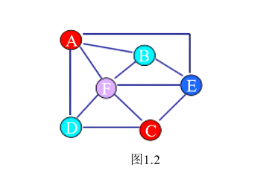

# 数据结构
## 线性表:
### 顺序表(数组)
### 链表(单向链表、单向循环链表、双向链表、双向循环链表)
### 栈(顺序栈、链式栈)
### 队列(循环队列、链式队列)
### 树 (特性，二叉树)
# 算法 (排序方法、查找方法)

# 为什么学数据结构
1. 写更简洁、高效的程序
2. 如果遇到一个实际问题，需要写代码实现相应功能
1) 如何表达数据之间的逻辑
   
2) 采用什么方法解决
采用算法解决

==> 数据结构 + 算法 = 程序

如果遇到问题 -->数据结构 + 算法 = 程序 --> 解决问题

# 数据结构
## 什么是数据结构
数据的逻辑结构以及存储操作（数据的运算）
数据结构是要让我们更高效的存储数据
## 数据
数据：不再是单纯的数字，而是类似于集合的概念
数据元素：是数据的基本单位，由若干个数据项组成的
数据项：数据的最小单位，表述数据元素的有用信息
数据元素又叫节点（所以应该是节点套节点，被套的节点是套他的节点的数据项）
## 逻辑结构
数据元素并不是孤立存在的，他们之间存在某种关系（或联系、结构），元素和元素之间的关系：
1. 线性关系
线性结构 -> 一对一 ->线性表：顺序表、链表、栈、队列
2. 层次关系
树形结构 -> 一对多 -> 树：二叉树
3. 网状关系
图状结构 -> 多对多-> 图

## 存储结构
数据的逻辑结构在计算机中的具体实现
### 顺序存储
特点：内存连续，用数组实现，随机存取，每个元素占用空间较少
数组：内存连续
### 链式存储
特点：内存不连续，通过指针实现。（节点中其中一个数据项是指针，指针指向下一个节点）
链表实现：
结构体（数据域|指针域）
### 索引存储
在存储数据的同时，建立一张附加的索引表。
索引存储 = 索引表 + 数据文件（类似字典）
### 散列存储
数据存储按照和关键码之间的关系进行存储，关系有自己决定，比如关键码是key，存储的位置也就是关系是key+1。获取关机数据，通过元素的关键码和关系的返回值来获取。
存的时候，按照关系存
取的时候，按照关系取
## 操作
增 删 改 查
# 算法基础知识
算法就是解决问题的思想方式，数据结构是算法的基础
数据机构 + 算法 = 程序
## 算法的设计
算法的设计：取决于数据的逻辑结构
算法的时间：依赖于数据的存储结构
## 评价算法的好坏
时间复杂度
时间规模函数：T(n) = O(f(n))
T(n)    //时间规模的时间函数
O       //时间数量级
n       //问题规模
f(n)    //算法壳执行语句重复执行的次数

# 线性表
## 顺序表
### 特性
内存连续
线性结构
顺序存储
### 数组
操作数组
添加全局变量last表示最后一个有效元素下标
顺序表最终实现
```c
#define N 64

typedef struct seplist
{
    int data[N];
    int last;
}ss, *sp;
```