所有新学的函数的三要素
头文件与其函数的对应
从头自己学一下，把函数都记住
小计划：全部总结一下，然后自己写个框架，然后根据IO进程的本质进行分类，优先记框架


算法的学习


除了STDIN_FILENO还有啥
什么是OS级阻塞
msgrcv是啥函数
atoi的相对的函数是啥
getpid()是啥    还有个getpdid
signal(SIGIO, handler)咋用的
同步(阻塞)，非同步(非阻塞)，异步(信号驱动)怎么判断
```
如果我对这个终端设置了非阻塞，那我其他终端会受影响吗
用软硬连接呢
不同文件呢
head读取的行数有上限吗，我的是int的最大值行
```
秒微秒为什么可以直接传结构体
两个循环怎么改成一个循环
read的\n问题
select剩下三个null是啥
标准输入跟键盘的输入的区别

init进程
所以计算机的诞生确实是产生着无限的可能

有什么阻塞的办法可以让两个进程输入输出一对一反应吗
让key的三个部分分别自定义改动

IPC_CREAT | IPC_EXCL不用这个及其他情况
每个线程是怎么操作的，怎么看线程的状态

scanf("%s", arr);
        sem_post (&sem);                為什麽在中間
        // flag = 1;    
        if (!strcmp(arr, "quit"))
            break;

数据结构中的树，网，算法，时间复杂度

为什么输入信号不稳定就能拉高到高电平，什么是电平状态稳定
引脚能读取电平信号？
什么是下拉电平，怎么判断的


虚短中，什么叫存在负反馈

串联公式

1. 

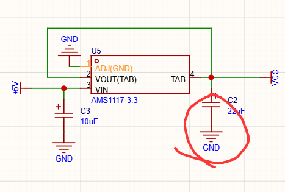
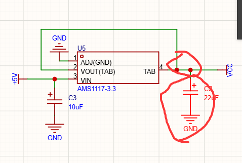

有什么区别吗

2. 

这些元器件怎么选的，根据什么东西选的


3. 
为什么有时候电容是从这个常用库里拿，有时候是从shift+f里搜，有的是要去看手册找电容有的却不用看，有的手册里甚至没有提到电容需要的样式

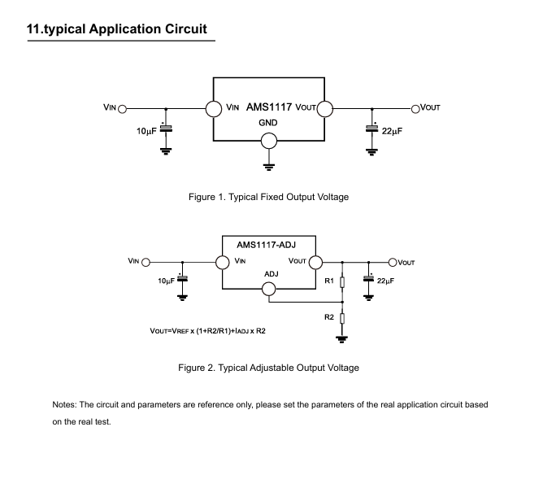


5. 
主要是
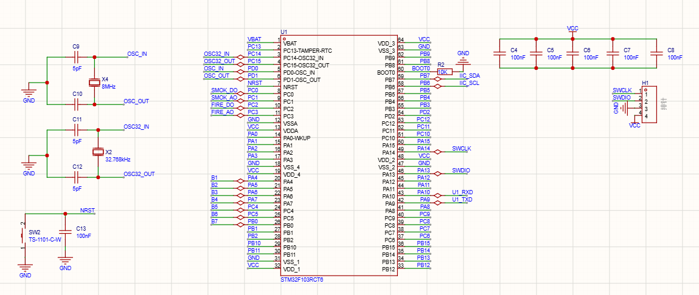

这个我可以背过但除了这个以外的所有的都是要灵活的，但我不知道怎么灵活

6. 
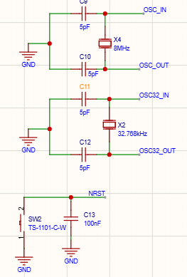

为什么这个电容的数字可以手动改呢，而有些就不让改，比如那些从shift+f里拿出来的

7. 
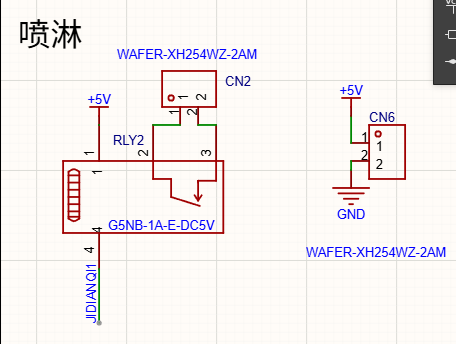

什么时候可以用继电器，什么时候不用呢，这个不也是5v吗

8. 
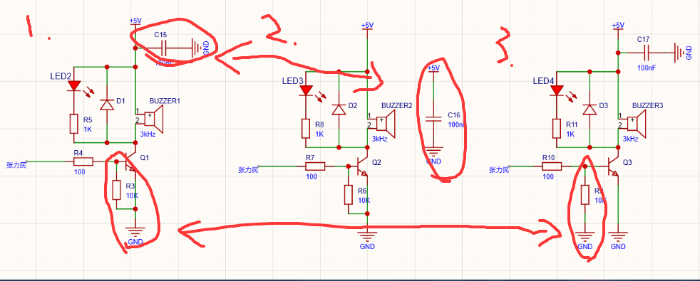

有什么区别

9. 
什么是XH2.54

10. 
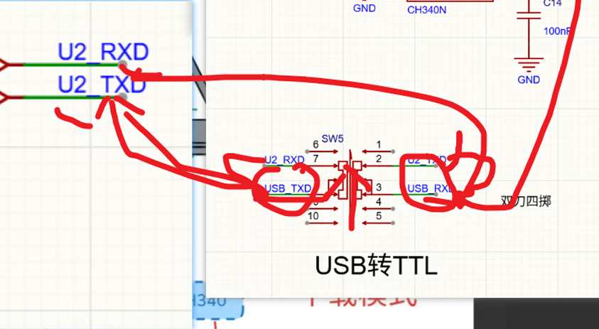

这是并联串联，就是，我两个网络标签写同一个名字就算连起来了，但这连起来的算是并联上的还是串联上的

11. 
什么时候用vcc什么时候用v5

12. 
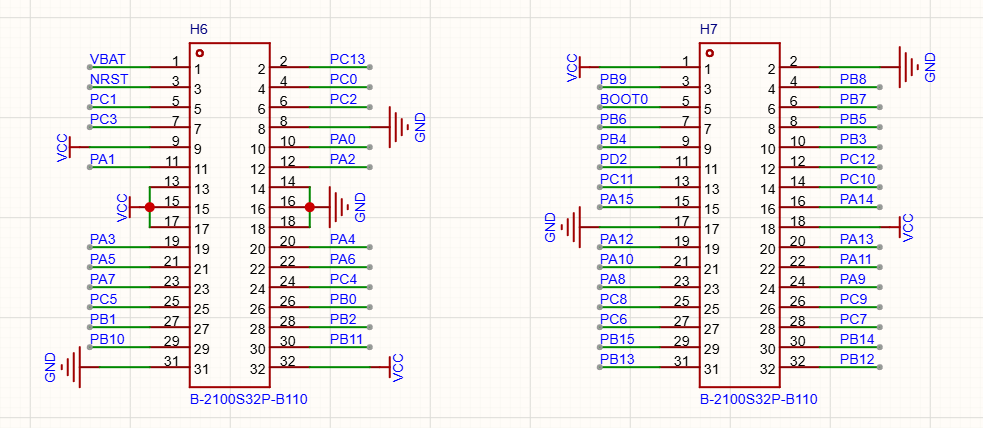   这个图是怎么连的，这么多串口而且还没有规律

13. 
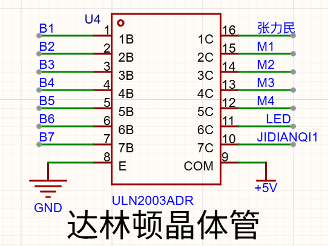

这种是怎么接到单片机上的，他没跟单片机任何一个引脚连起来，就只跟电源和地线连起来了，我怎么用单片机控制他呢

14. 
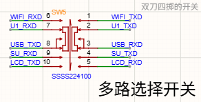

如果这是个四掷开关，那我同一时间是不是只能做一件事（比如我现在把开关拨到wifi上，那我别的模块是不是就做不了了）

15. 
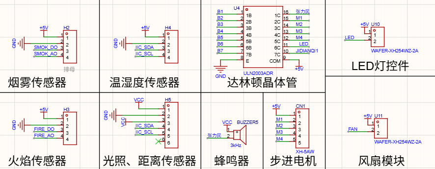

为什么后面这些用到了达林顿晶体管，但前面的传感器没用到，同样为什么后面的各种模块（wifi，语音）没用达林顿晶体管呢

16. 
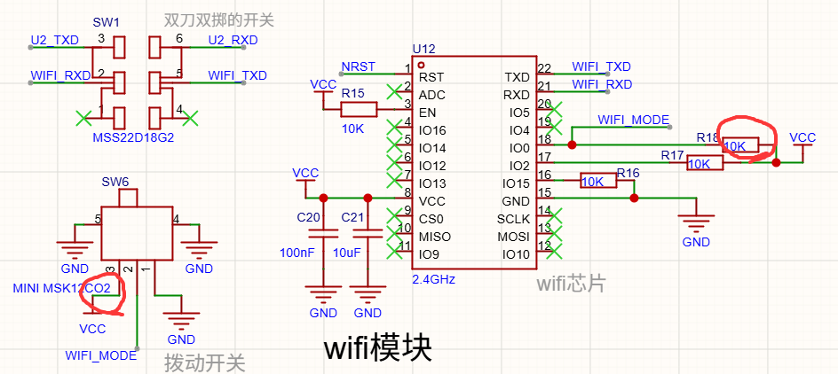

这里为什么不需要再加个电阻了

19. 
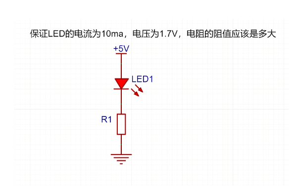
假如我们在第一天学的这个，电阻的阻值是3百多，为什么有时候画电路图算都没算直接给了个1k的电阻

20. 

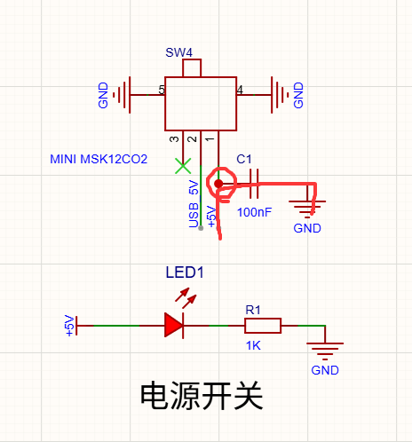
这个电容为什么可以这样连呢，这样不会直接从电容流过去直接流到地线吗

4. 

我们在前面学了各种理论基础，各种电路（同向比例放大电路，加法电路之类的），还有一些三极管各种状态啥的，这些理论跟后面的画板子在我脑海里没什么关系，我怎么把他们联系起来呢


短接符是啥

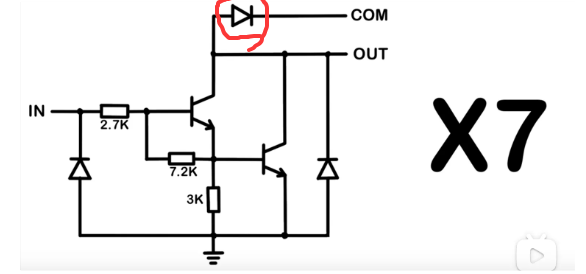

MCU是啥

什么叫引脚外挂

什么是RC延时电路
